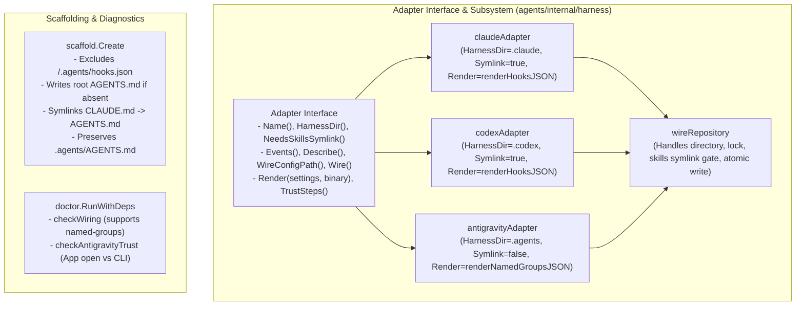

# Antigravity Multi-Harness Onboarding Implementation Plan

> **For agentic workers:** REQUIRED SUB-SKILL: Use superpowers:subagent-driven-development to implement this plan task-by-task. Steps use checkbox (`- [ ]`) syntax for tracking.

**Goal:** Implement native Antigravity (`agy` 1.1.22 / Desktop App) support in `agents`, featuring `named-groups` hook rendering, decoupled skills symlinking, dual-layer instruction scaffolding (`AGENTS.md` / `.agents/AGENTS.md`), exclusion purity, and end-to-end sandbox verification for `autogo-mlx` and fleet repositories.

**Architecture:** Extend `Adapter` with `HarnessDir()`, `NeedsSkillsSymlink()`, and `Render()` methods so `wireRepository` handles directory locks and atomic writes without dialect coupling. Implement `antigravityAdapter` supporting `named-groups` config format and dual-shape hook stripping. Scaffolding writes canonical root `AGENTS.md` (symlinked by `CLAUDE.md`) while preserving existing `.agents/AGENTS.md`, and excludes `.agents/hooks.json` in `.git/info/exclude`. Verification executes across unit tests, sandboxes with isolated registry state (`XDG_STATE_HOME`), and live fleet onboarding.

**Architecture Diagram:**



**Tech Stack:** Go 1.24+, `posixquote`, `crypto/sha256`, `encoding/json`, `os`, `path/filepath`, `strings`

**Spec:** [`docs/design/2026-08-28-antigravity-multi-harness-onboarding.md`](../design/2026-08-28-antigravity-multi-harness-onboarding.md)

## Global Constraints

- Never modify or write to maintainer's tracked `.gitignore` (machine-local exclusions belong strictly in `.git/info/exclude`).
- `scaffold.Create` must never overwrite or delete existing instruction files (`.agents/AGENTS.md` or `AGENTS.md`).
- `Build` must discard unmapped protojson fields during decoding to preserve the structural redaction guarantee.
- Ordinals (`stepIdx`/`invocationNum`) must never populate `Trace.TurnID` (must stay empty for Antigravity).
- Every sandbox invocation must use `XDG_STATE_HOME=$(mktemp -d)` to isolate the machine's fleet registry.

---

### Task 1: Decouple Skills Symlink & Add `Render()` to `Adapter`

**Files:**
- Modify: `agents/internal/harness/harness.go`
- Modify: `agents/internal/harness/claudecode.go`
- Modify: `agents/internal/harness/codex.go`
- Test: `agents/internal/harness/harness_test.go`

**Interfaces:**
- `Adapter`:
  ```go
  type Adapter interface {
      Name() string
      HarnessDir() string
      NeedsSkillsSymlink() bool
      Capabilities() Capabilities
      Events() []Event
      Describe(p Payload, transcript string) string
      WireConfigPath(repoRoot string) string
      Wire(repoRoot, binary string) error
      Render(settings map[string]any, binary string) ([]byte, error)
      TrustSteps(repoRoot string) []string
  }
  ```
- `claudeAdapter`: `HarnessDir() string { return ".claude" }`, `NeedsSkillsSymlink() bool { return true }`, `Render(settings map[string]any, binary string) ([]byte, error) { return renderHooksJSON(settings, a.Name(), a.Events(), binary) }`
- `codexAdapter`: `HarnessDir() string { return ".codex" }`, `NeedsSkillsSymlink() bool { return true }`, `Render(settings map[string]any, binary string) ([]byte, error) { return renderHooksJSON(settings, a.Name(), a.Events(), binary) }`

- [ ] **Step 1: Write failing test in `harness_test.go` asserting `HarnessDir`, `NeedsSkillsSymlink`, and `Render` on existing adapters**

```go
func TestAdapterInterfaceExtensions(t *testing.T) {
    for _, a := range All() {
        if a.HarnessDir() == "" {
            t.Errorf("%s: HarnessDir() must not be empty", a.Name())
        }
        if a.Name() == "claude-code" || a.Name() == "codex" {
            if !a.NeedsSkillsSymlink() {
                t.Errorf("%s: NeedsSkillsSymlink() should be true", a.Name())
            }
        }
    }
}
```

- [ ] **Step 2: Run test to verify failure**

Run: `go test ./agents/internal/harness -run TestAdapterInterfaceExtensions`  
Expected: Compile error: `a.HarnessDir undefined`, `a.NeedsSkillsSymlink undefined`

- [ ] **Step 3: Update `Adapter` interface and `wireRepository` in `harness.go`, `claudecode.go`, and `codex.go`**

Update `harness.go` interface and `wireRepository`:
```go
func wireRepository(repoRoot string, a Adapter, binary string) error {
    harnessDir := a.HarnessDir()
    configName := filepath.Base(a.WireConfigPath(repoRoot))

    dir, dirPath, err := openHarnessDir(repoRoot, harnessDir)
    if err != nil {
        return err
    }
    defer dir.Close()
    lock, err := acquireWireLock(dir, dirPath)
    if err != nil {
        return err
    }
    defer releaseWireLock(lock)

    var skills skillsSnapshot
    if a.NeedsSkillsSymlink() {
        var err error
        skills, err = preflightSkills(dir, dirPath)
        if err != nil {
            return err
        }
        if !skills.exists {
            if err := dir.Symlink(filepath.Join("..", ".agents", "skills"), "skills"); err != nil {
                return err
            }
            skills, err = preflightSkills(dir, dirPath)
            if err != nil {
                return err
            }
        }
    }

    settings, snapshot, err := readHooksJSON(dir, dirPath, configName)
    if err != nil {
        return err
    }
    out, err := a.Render(settings, binary)
    if err != nil {
        return err
    }

    validate := func() error {
        if a.NeedsSkillsSymlink() {
            return validateSkills(dir, dirPath, skills)
        }
        return nil
    }
    return atomicWriteHooks(dir, dirPath, configName, out, snapshot, validate)
}
```

- [ ] **Step 4: Run tests to verify they pass**

Run: `go test ./agents/internal/harness/... -v`  
Expected: PASS

- [ ] **Step 5: Commit changes**

```bash
git add agents/internal/harness/
git commit -m "refactor(harness): decouple skills symlink and dialect rendering on Adapter interface"
```

---

### Task 2: Implement Antigravity Adapter & `named-groups` Dialect Engine

**Files:**
- Modify: `agents/internal/harness/harness.go`
- Create: `agents/internal/harness/antigravity.go`
- Create: `agents/internal/harness/antigravity_test.go`

**Interfaces:**
- `knownHarness(name string) bool`: returns `true` for `"antigravity"`.
- `Payload`: decodes camelCase fields `conversationId`, `transcriptPath`, `workspacePaths`.
- `Build`: normalizes `SessionID` before `key`, includes `TranscriptPathCamel` in `pointer.Resolve`, collapses `WorkspacePaths[0]` to `Cwd`, leaves `TurnID` empty.
- `antigravityAdapter`: implements all 10 `Adapter` methods.

- [ ] **Step 1: Write failing unit tests in `antigravity_test.go`**

```go
package harness

import (
    "encoding/json"
    "os"
    "path/filepath"
    "testing"
)

func TestAntigravityWiring(t *testing.T) {
    tmp := t.TempDir()
    a, ok := Lookup("antigravity")
    if !ok {
        t.Fatal("antigravity adapter not found")
    }
    bin := "/bin/agents"
    if err := a.Wire(tmp, bin); err != nil {
        t.Fatalf("Wire() error = %v", err)
    }

    cfgPath := a.WireConfigPath(tmp)
    data, err := os.ReadFile(cfgPath)
    if err != nil {
        t.Fatalf("failed to read config: %v", err)
    }

    var root map[string]any
    if err := json.Unmarshal(data, &root); err != nil {
        t.Fatalf("invalid json: %v", err)
    }
    agentsObj, ok := root["agents"].(map[string]any)
    if !ok {
        t.Fatalf("expected top-level 'agents' object, got %v", root)
    }
    stopList, ok := agentsObj["Stop"].([]any)
    if !ok || len(stopList) != 1 {
        t.Fatalf("expected 1 Stop hook in 'agents', got %v", agentsObj["Stop"])
    }
}

func TestAntigravityWiringIdempotency(t *testing.T) {
    tmp := t.TempDir()
    a, ok := Lookup("antigravity")
    if !ok {
        t.Fatal("antigravity adapter not found")
    }
    bin := "/bin/agents"
    for i := 0; i < 3; i++ {
        if err := a.Wire(tmp, bin); err != nil {
            t.Fatalf("Wire() pass %d error = %v", i+1, err)
        }
    }

    data, _ := os.ReadFile(a.WireConfigPath(tmp))
    var root map[string]any
    _ = json.Unmarshal(data, &root)
    agentsObj := root["agents"].(map[string]any)
    stopList := agentsObj["Stop"].([]any)
    if len(stopList) != 1 {
        t.Fatalf("expected exactly 1 Stop hook after 3 wires, got %d", len(stopList))
    }
}

func TestAntigravityPayloadRedaction(t *testing.T) {
    raw := `{
        "conversationId": "conv-123",
        "transcriptPath": "/tmp/transcript.jsonl",
        "lastUserInput": "SECRET_USER_INPUT_DO_NOT_LEAK",
        "raw_tool_input": "SECRET_TOOL_INPUT"
    }`
    p, err := Decode([]byte(raw))
    if err != nil {
        t.Fatalf("Decode() err = %v", err)
    }
    if p.ConversationID != "conv-123" {
        t.Errorf("ConversationID = %s, want conv-123", p.ConversationID)
    }
    // Verify struct has no fields holding secret values
    data, _ := json.Marshal(p)
    if string(data) != `{"conversationId":"conv-123","transcriptPath":"/tmp/transcript.jsonl"}` {
        // Must not contain lastUserInput
        if jsonContains(string(data), "SECRET_USER_INPUT") {
            t.Errorf("Payload leaked unmapped forbidden field: %s", data)
        }
    }
}
```

- [ ] **Step 2: Run tests to verify failure**

Run: `go test ./agents/internal/harness -run "TestAntigravity.*"`  
Expected: FAIL (antigravity adapter not registered)

- [ ] **Step 3: Implement `antigravity.go`, update `knownHarness`, `All()`, and `Build` in `harness.go`**

Implement `antigravity.go`:
```go
package harness

import (
    "encoding/json"
    "path/filepath"
    "strings"
)

func init() {
    register(antigravityAdapter{})
}

type antigravityAdapter struct{}

func (a antigravityAdapter) Name() string { return "antigravity" }
func (a antigravityAdapter) HarnessDir() string { return ".agents" }
func (a antigravityAdapter) NeedsSkillsSymlink() bool { return false }
func (a antigravityAdapter) Capabilities() Capabilities { return Capabilities{Description: false} }
func (a antigravityAdapter) Events() []Event {
    return []Event{{Semantic: Stop, Vendor: "Stop"}}
}
func (a antigravityAdapter) Describe(p Payload, transcript string) string { return "" }
func (a antigravityAdapter) WireConfigPath(repoRoot string) string {
    return filepath.Join(repoRoot, ".agents", "hooks.json")
}
func (a antigravityAdapter) TrustSteps(repoRoot string) []string {
    return []string{
        "Antigravity App: open the workspace folder (hooks execute automatically).",
        "Antigravity CLI: add repository root to trustedWorkspaces in ~/.gemini/antigravity-cli/settings.json.",
    }
}
func (a antigravityAdapter) Wire(repoRoot, binary string) error {
    return wireRepository(repoRoot, a, binary)
}
func (a antigravityAdapter) Render(settings map[string]any, binary string) ([]byte, error) {
    return renderNamedGroupsJSON(settings, a.Name(), a.Events(), binary)
}

func renderNamedGroupsJSON(settings map[string]any, harnessName string, events []Event, binary string) ([]byte, error) {
    root := make(map[string]any)
    for k, v := range settings {
        root[k] = v
    }

    var agentsGroup map[string]any
    if existing, ok := root["agents"].(map[string]any); ok {
        agentsGroup = stripOursNamedGroups(existing)
    } else {
        agentsGroup = make(map[string]any)
    }

    for _, ev := range events {
        cmd := HookCommand(binary, ev.Semantic, harnessName)
        entry := map[string]any{
            "type":    "command",
            "command": cmd,
        }
        if ev.Vendor == "PreToolUse" || ev.Vendor == "PostToolUse" {
            matcherGroup := map[string]any{
                "matcher": ev.Matcher,
                "hooks":   []any{entry},
            }
            var existingGroups []any
            if eg, ok := agentsGroup[ev.Vendor].([]any); ok {
                existingGroups = eg
            }
            agentsGroup[ev.Vendor] = append(existingGroups, matcherGroup)
        } else {
            var existingEntries []any
            if ee, ok := agentsGroup[ev.Vendor].([]any); ok {
                existingEntries = ee
            }
            agentsGroup[ev.Vendor] = append(existingEntries, entry)
        }
    }

    root["agents"] = agentsGroup
    return json.MarshalIndent(root, "", "  ")
}

func stripOursNamedGroups(group map[string]any) map[string]any {
    out := make(map[string]any)
    for evName, val := range group {
        slice, ok := val.([]any)
        if !ok {
            out[evName] = val
            continue
        }
        var kept []any
        for _, item := range slice {
            m, ok := item.(map[string]any)
            if !ok {
                kept = append(kept, item)
                continue
            }
            if innerHooks, hasHooks := m["hooks"].([]any); hasHooks {
                var keptInner []any
                for _, h := range innerHooks {
                    hm, ok := h.(map[string]any)
                    if ok {
                        if cmd, ok := hm["command"].(string); ok && IsOwnedHookCommand(cmd) {
                            continue
                        }
                    }
                    keptInner = append(keptInner, h)
                }
                if len(keptInner) > 0 {
                    m["hooks"] = keptInner
                    kept = append(kept, m)
                }
            } else {
                if cmd, ok := m["command"].(string); ok && IsOwnedHookCommand(cmd) {
                    continue
                }
                kept = append(kept, item)
            }
        }
        if len(kept) > 0 {
            out[evName] = kept
        }
    }
    return out
}
```

Update `knownHarness` in `harness.go:244`:
```go
func knownHarness(name string) bool {
    switch name {
    case "claude-code", "codex", "antigravity":
        return true
    default:
        return false
    }
}
```

Update `All()` in `harness.go:119`:
```go
func All() []Adapter {
    names := []string{"claude-code", "codex", "antigravity"}
    ...
}
```

Update `Payload` struct and `Build` in `harness.go`:
```go
type Payload struct {
    HookEventName       string   `json:"hook_event_name"`
    SessionID           string   `json:"session_id"`
    ConversationID      string   `json:"conversationId"`
    TurnID              string   `json:"turn_id"`
    PromptID            string   `json:"prompt_id"`
    AgentID             string   `json:"agent_id"`
    AgentType           string   `json:"agent_type"`
    Cwd                 string   `json:"cwd"`
    WorkspacePaths      []string `json:"workspacePaths"`
    TranscriptPath      string   `json:"transcript_path"`
    TranscriptPathCamel string   `json:"transcriptPath"`
    AgentTranscriptPath string   `json:"agent_transcript_path"`
    Source              string   `json:"source"`
}

func Build(p Payload, harnessName string) (Trace, bool) {
    sessionID := p.SessionID
    if sessionID == "" {
        sessionID = p.ConversationID
    }
    key := pointerKey(harnessName, sessionID)
    transcriptPath := pointer.Resolve([]string{p.AgentTranscriptPath, p.TranscriptPath, p.TranscriptPathCamel}, key)
    cwd := p.Cwd
    if cwd == "" && len(p.WorkspacePaths) > 0 {
        cwd = p.WorkspacePaths[0]
    }

    t := Trace{
        SessionID:      sessionID,
        TurnID:         turnID(p),
        AgentID:        p.AgentID,
        AgentType:      p.AgentType,
        Cwd:            cwd,
        TranscriptPath: transcriptPath,
        Source:         p.Source,
        Harness:        harnessName,
    }
    return t, true
}
```

- [ ] **Step 4: Run tests to verify they pass**

Run: `go test ./agents/internal/harness/... -v`  
Expected: PASS

- [ ] **Step 5: Commit changes**

```bash
git add agents/internal/harness/
git commit -m "feat(harness): implement Antigravity adapter, named-groups dialect, and payload normalization"
```

---

### Task 3: Scaffolding Exclusions & Diagnostics

**Files:**
- Modify: `agents/internal/scaffold/scaffold.go`
- Modify: `agents/internal/doctor/doctor.go`
- Test: `agents/internal/scaffold/scaffold_test.go`
- Test: `agents/internal/doctor/doctor_test.go`
- Test: `agents/cmd_init_test.go`

**Interfaces:**
- `scaffold.excludeLines`: contains `/.agents/hooks.json` and `/.agents/.agents-wire.lock`.
- `scaffold.DefaultAgentsMD`: canonical dual-layer context preamble.
- `scaffold.Create(repoRoot, local)`: creates root `AGENTS.md` if absent, symlinks `CLAUDE.md -> AGENTS.md`, and leaves `.agents/AGENTS.md` untouched.
- `doctor.checkWiring`: supports `named-groups` format for `wiring:antigravity`.
- `doctor.checkAntigravityTrust`: reports App open behavior (no gate) and checks CLI `trustedWorkspaces`.

- [ ] **Step 1: Write failing tests in `scaffold_test.go` and `doctor_test.go`**

```go
func TestScaffoldExclusionsIncludeAntigravity(t *testing.T) {
    tmp := t.TempDir()
    if err := Create(tmp, false); err != nil {
        t.Fatalf("Create() error = %v", err)
    }
    excludePath := filepath.Join(tmp, ".git", "info", "exclude")
    data, err := os.ReadFile(excludePath)
    if err != nil {
        t.Fatalf("read exclude error = %v", err)
    }
    content := string(data)
    if !strings.Contains(content, "/.agents/hooks.json") {
        t.Error("missing /.agents/hooks.json in exclude")
    }
    if !strings.Contains(content, "/.agents/.agents-wire.lock") {
        t.Error("missing /.agents/.agents-wire.lock in exclude")
    }
}
```

- [ ] **Step 2: Run tests to verify failure**

Run: `go test ./agents/internal/scaffold -run TestScaffoldExclusionsIncludeAntigravity`  
Expected: FAIL

- [ ] **Step 3: Implement changes in `scaffold.go` and `doctor.go`**

Update `scaffold.go`:
```go
var excludeLines = []string{
    "/.claude/settings.json",
    "/.claude/.agents-wire.lock",
    "/.claude/skills",
    "/.codex/hooks.json",
    "/.codex/.agents-wire.lock",
    "/.codex/skills",
    "/.agents/hooks.json",
    "/.agents/.agents-wire.lock",
}

const DefaultAgentsMD = `# Agent context

Durable context for this repo lives in ` + "`docs/`" + `. Read it before assuming;
it is the record, and this file is only the pointer to it.

- ` + "`docs/qna/`" + ` — answers indexed by the question you would ask again
- ` + "`docs/journal/`" + ` — dated record of what happened
- ` + "`docs/design/`" + ` — the design still in force

## Repository Architecture & Guidelines
- Domain engineering guidelines, commenting standards, and safety constraints 
  are defined in ` + "`.agents/AGENTS.md`" + `.
- Repo-specific procedures and skills are located in ` + "`.agents/skills/`" + `.

## Machine Wiring
` + "`.agents/`" + ` holds machine wiring and local skills. A hook cannot install itself 
and a missing hook fails silently, so an empty or stale ` + "`.agents/`" + ` means the setup 
is broken rather than that there is nothing to say — report it rather than 
working around it.

Run ` + "`agents doctor`" + ` early and report any warnings before relying on this context.

Recording is covered by the global instruction and the ` + "`recording-what-you-learn`" + ` 
skill; it is not repo-specific and is not restated here.
`

func Create(root string, local bool) error {
    ...
    // Write root AGENTS.md if absent, symlink CLAUDE.md -> AGENTS.md
    if err := writeIfAbsent(filepath.Join(root, "AGENTS.md"), DefaultAgentsMD); err != nil {
        return err
    }
    if err := linkIfAbsent(filepath.Join(root, "CLAUDE.md"), "AGENTS.md"); err != nil {
        return err
    }
    ...
}
```

Update `doctor.go` `checkWiring` to handle `named-groups` dialect for `"antigravity"`.

- [ ] **Step 4: Run all tests to verify they pass**

Run: `go test ./agents/... -v`  
Expected: PASS

- [ ] **Step 5: Commit changes**

```bash
git add agents/internal/scaffold/ agents/internal/doctor/ agents/cmd_init.go
git commit -m "feat(scaffold,doctor): add Antigravity exclusions, dual-layer AGENTS.md, and named-groups doctor checks"
```

---

### Task 4: Execute Verification Protocol & Fleet Migration (Phases 1–5)

**Files:**
- Binary: `/tmp/agents-test-bin`

- [ ] **Step 1: Run Phase 1 Unit & Regression Suite**

Run: `cd /Users/nilbot/dotfiles/agents && go test ./... -v`  
Expected: All tests pass.

- [ ] **Step 2: Run Phase 2 Synthetic `autogo-mlx` Sandbox Verification**

```bash
# 1. Build test binary
cd /Users/nilbot/dotfiles/agents && go build -o /tmp/agents-test-bin .

# 2. Clone sandbox with submodules
rm -rf /tmp/sandbox-autogo-mlx
git clone --no-hardlinks --recurse-submodules /Users/nilbot/playground/autogo-mlx /tmp/sandbox-autogo-mlx

# 3. Capture baseline
BASELINE=$(git -C /tmp/sandbox-autogo-mlx status --porcelain)

# 4. Run onboarding inside sandbox with isolated state
cd /tmp/sandbox-autogo-mlx
XDG_STATE_HOME=$(mktemp -d) /tmp/agents-test-bin init

# 5. Assert dotfiles unchanged
git -C /Users/nilbot/dotfiles status --porcelain

# 6. Assert sandbox invariants
git -C /tmp/sandbox-autogo-mlx diff --name-only
git -C /tmp/sandbox-autogo-mlx diff .gitattributes
git -C /tmp/sandbox-autogo-mlx check-ignore -v .claude/settings.json .codex/hooks.json .agents/hooks.json .agents/.agents-wire.lock
git -C /tmp/sandbox-autogo-mlx diff --stat
XDG_STATE_HOME=$(mktemp -d) /tmp/agents-test-bin doctor
```

- [ ] **Step 3: Run Phase 3 Synthetic `cowork-enterprise` Fresh Repo Verification**

```bash
rm -rf /tmp/sandbox-cowork-enterprise
mkdir -p /tmp/sandbox-cowork-enterprise
cd /tmp/sandbox-cowork-enterprise && git init
echo "# Cowork Enterprise" > README.md
git add README.md && git commit -m "initial commit"

XDG_STATE_HOME=$(mktemp -d) /tmp/agents-test-bin init
XDG_STATE_HOME=$(mktemp -d) /tmp/agents-test-bin doctor
```

- [ ] **Step 4: Run Phase 4 Live Execution on `/Users/nilbot/playground/autogo-mlx`**

```bash
cd /Users/nilbot/dotfiles/agents && go install .
# Verify installed binary matches test binary hash
test $(shasum -a 256 $(which agents) | cut -d' ' -f1) = $(shasum -a 256 /tmp/agents-test-bin | cut -d' ' -f1)

cd /Users/nilbot/playground/autogo-mlx
agents init
git status
agents doctor
```

- [ ] **Step 5: Run Phase 5 Fleet Migration**

```bash
agents ls
# In each registered repo root:
# agents init
# git check-ignore -v .agents/hooks.json .agents/.agents-wire.lock
# git status --porcelain .agents/
```
