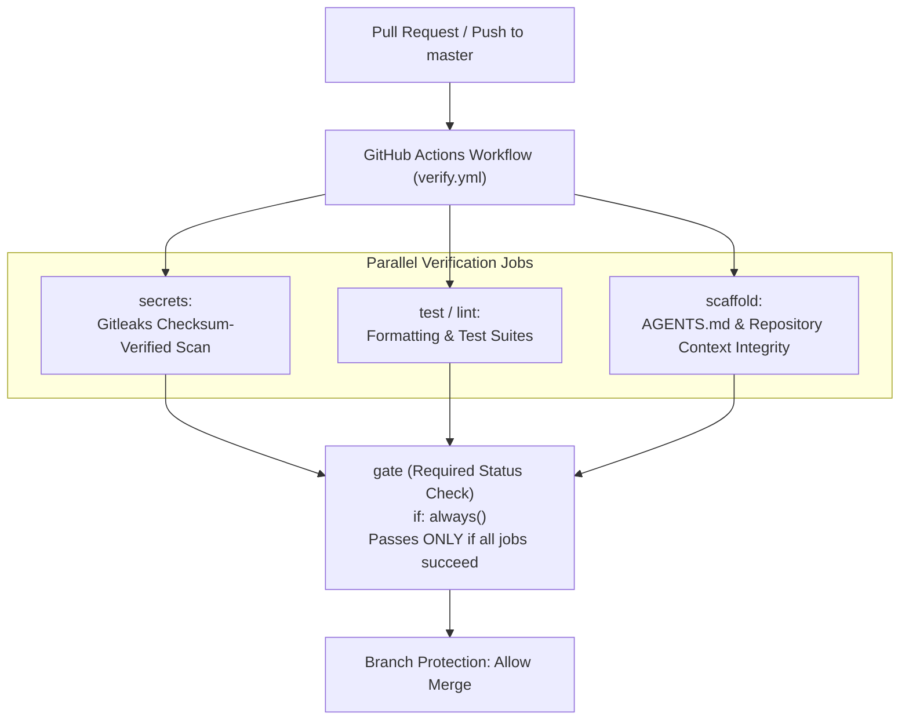

# Authoritative CI Verification Gate Template Design

**Date:** 2026-08-28  
**Status:** Designed  
**Context:** Phase 4 of [Contributor Guardrails & Scaffold Decoupling](2026-08-28-contributor-guardrails-and-scaffold-decoupling.md)  
**Depends on:** [Spec 5](2026-08-11-spec-5-verification-gate.md), [Spec 6](2026-08-11-spec-6-releases-and-distribution.md)  

---

## 1. Executive Summary

When repositories are opened to external collaborators or autonomous agents, local git pre-commit hooks (`agents guard --staged`) can be bypassed (e.g. `git commit --no-verify`) or omitted by contributors who do not have `agents` or `gitleaks` installed locally.

The **Authoritative CI Verification Gate** serves as the non-bypassable server-side enforcement layer on GitHub Actions for pull requests and branch pushes, ensuring that:
1. No secrets or credentials enter the commit history.
2. Code style, formatting, and unit tests pass before merge.
3. Repository context (`AGENTS.md`) and harness wiring conventions are preserved.
4. A single required check (`gate`) simplifies branch protection configuration.

---

## 2. CI Gate Architecture

---

## 3. Template Specifications

### 3.1 Security & Action Pinning Standard

Every GitHub Action reference in `verify.yml` must adhere to immutable commit SHA pinning with trailing release annotations:
- `actions/checkout@11d5960a326750d5838078e36cf38b85af677262 # v4.4.0` (with `fetch-depth: 0` for git range history inspection)
- Minimal permissions declared at root: `permissions: contents: read`.

### 3.2 Job Specifications

1. **`secrets`**:
   - Downloads checksum-verified `gitleaks` binary (or runs official action).
   - Scans PR commit range: `gitleaks git --redact --exit-code 1`.
2. **`test` / `lint`**:
   - Executes language-specific static analysis and test runner (e.g. `gofmt` / `ruff` / `eslint`, test suites).
3. **`scaffold`**:
   - Verifies that root `AGENTS.md` (or `CLAUDE.md`) exists and is non-empty.
   - Verifies `.gitattributes` carries `.agents/** linguist-generated=true` if `.agents/` is present.
4. **`gate`**:
   - Runs with `if: always()`, checks `needs.*.result == 'success'`.
   - The sole required check configured in GitHub Branch Protection rules.

---

## 4. Location & Distribution

The canonical template is maintained at:
- `template/ci/verify.yml`

Target repositories (such as `toolshed/cowork` and new projects) copy this file into `.github/workflows/verify.yml`.
