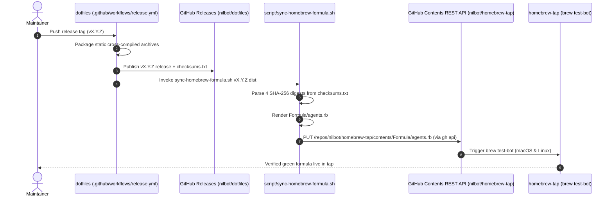

# Automated Release & Homebrew Tap Synchronization Architecture

**Date:** 2026-08-28  
**Status:** Designed  
**Context:** Automation of cross-repo release distribution between `nilbot/dotfiles` and `nilbot/homebrew-tap`  
**Depends on:** [Spec 6 (Releases and Distribution)](2026-08-11-spec-6-releases-and-distribution.md), [Contributor Guardrails](2026-08-28-contributor-guardrails-and-scaffold-decoupling.md)

---

## 1. Executive Summary

Previously, releasing a new version of `agents` required manual developer intervention:
1. Pushing a tag to `nilbot/dotfiles`.
2. Waiting for CI release workflow to upload release tarballs and `checksums.txt`.
3. Manually downloading `checksums.txt` and extracting the 4 SHA-256 digests.
4. Manually updating `Formula/agents.rb` in `nilbot/homebrew-tap`.
5. Manually committing and pushing to `homebrew-tap`.

This design establishes a **fully automated, zero-clone release and formula synchronization pipeline**. Once a release tag (e.g. `v0.2.0`) is pushed to `dotfiles`, GitHub Actions automatically compiles release assets, uploads the GitHub Release, renders `Formula/agents.rb`, and updates `nilbot/homebrew-tap` directly via the GitHub Contents REST API in a single frictionless run.

---

## 2. System Architecture & Data Flow



---

## 3. Component Specifications

### 3.1 Synchronizer Script (`script/sync-homebrew-formula.sh`)

A deterministic, offline-testable shell script with zero external dependencies beyond `gh` (or `curl`) and `base64`.

**Interface & Arguments:**
```bash
bash script/sync-homebrew-formula.sh <VERSION> [DIST_DIR]
```

**Responsibilities:**
1. **Version Normalization**: Strips any leading `v` (e.g. `v0.2.0` -> `0.2.0`) for clean URL and formula rendering.
2. **Digest Extraction & Validation**:
   - Reads `${DIST_DIR}/checksums.txt`.
   - Extracts:
     - `DARWIN_ARM64_SHA` (`agents_*_darwin_arm64.tar.gz`)
     - `DARWIN_AMD64_SHA` (`agents_*_darwin_amd64.tar.gz`)
     - `LINUX_ARM64_SHA` (`agents_*_linux_arm64.tar.gz`)
     - `LINUX_AMD64_SHA` (`agents_*_linux_amd64.tar.gz`)
   - Asserts all 4 digests are non-empty, 64-character lowercase hexadecimal strings.
3. **Formula Rendering**:
   - Generates [`Formula/agents.rb`](../../Formula/agents.rb) strictly adhering to Homebrew RuboCop guidelines (`# typed: false`, `# frozen_string_literal: true`, 2-space indentation, `license "MIT"`, no redundant `version` line).
   - Writes generated formula to `Formula/agents.rb` in local repository.
4. **Direct REST API Commit**:
   - If `GH_TOKEN` or `HOMEBREW_TAP_TOKEN` is present:
     - Queries current remote file SHA: `gh api repos/nilbot/homebrew-tap/contents/Formula/agents.rb --jq '.sha'`.
     - Base64-encodes new formula contents.
     - Performs `PUT /repos/nilbot/homebrew-tap/contents/Formula/agents.rb` with commit message `feat(agents): update formula to v${VERSION}`.
   - If token is absent:
     - Emits `[dry-run] HOMEBREW_TAP_TOKEN not set; generated Formula/agents.rb locally.`

### 3.2 Workflow Integration (`.github/workflows/release.yml`)

Adds a discrete step immediately following GitHub Release creation:

```yaml
      - name: sync formula to homebrew-tap
        if: env.HOMEBREW_TAP_TOKEN != ''
        env:
          GH_TOKEN: ${{ secrets.HOMEBREW_TAP_TOKEN }}
          HOMEBREW_TAP_TOKEN: ${{ secrets.HOMEBREW_TAP_TOKEN }}
        run: |
          bash script/sync-homebrew-formula.sh "${{ steps.version.outputs.version }}" dist
```

---

## 4. Security & Permissions

1. **Repository Secret**: Stored in `nilbot/dotfiles` as encrypted secret `HOMEBREW_TAP_TOKEN`.
2. **Least Privilege**: Fine-grained Personal Access Token scoped strictly to:
   - Repository: `nilbot/homebrew-tap`
   - Permissions: `Contents: Read and Write`
3. **Auditability**: Every formula update is recorded as an explicit, traceable commit by `github-actions[bot]` in `nilbot/homebrew-tap` that triggers `brew test-bot`.

---

## 5. Verification Plan

1. **Unit & Dry-Run Verification**:
   - Run `script/sync-homebrew-formula.sh` with synthetic `checksums.txt` in a temporary directory without token to verify exact formula output formatting.
   - Run `ruby -c Formula/agents.rb` to ensure syntax validity.
2. **Live Tag Test**:
   - Publish a new release tag `v0.2.0` (or `workflow_dispatch`).
   - Observe `.github/workflows/release.yml` executing packaging, creating release `v0.2.0`, updating `nilbot/homebrew-tap` via API.
   - Observe `nilbot/homebrew-tap` triggering and passing `brew test-bot` on GitHub Actions.
   - Verify `brew update && brew upgrade agents` succeeds.
