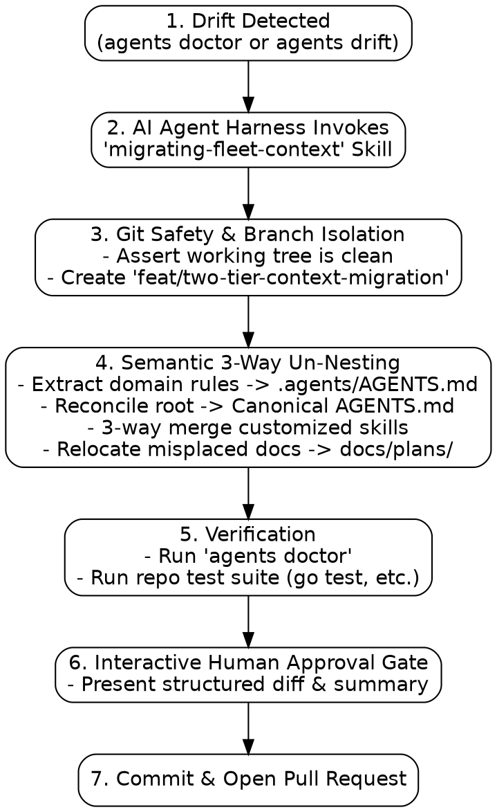

# Design: Two-Tier Agent Context and LLM-in-the-Loop Migration Architecture

**Date:** 2026-08-29 (Updated 2026-08-31)  
**Status:** Approved in Brainstorming (Ready for Implementation Planning)  
**Applies to:** `agents` CLI (`scaffold`, `drift`, `doctor`, `fleet`), `AGENTS.md` / `CLAUDE.md`, `.agents/AGENTS.md`, `.agents/skills/`, `.agents/skills/migrating-fleet-context/`  
**Depends on:** [Spec 1](2026-08-07-agents-repo-context-design.md) (harness adapters, exit codes), [Knowledge is Documentation](2026-08-19-knowledge-is-documentation.md) (2026-08-19), [Contributor Guardrails](2026-08-28-contributor-guardrails-and-scaffold-decoupling.md) (2026-08-28), [Binary Identity & Standalone Resolution](2026-08-28-binary-identity-and-standalone-resolution.md) (2026-08-28)  
**Reads against:** [`docs/qna/why-does-agents-init-never-update-existing-instructions.md`](../qna/why-does-agents-init-never-update-existing-instructions.md), [`docs/qna/how-does-two-tier-agent-context-prevent-scaffold-drift.md`](../qna/how-does-two-tier-agent-context-prevent-scaffold-drift.md)

---

## 1. Executive Summary & Problem Formulation

### 1.1 The Deterministic Migration Dilemma
Earlier iterations of repository scaffolding treated `AGENTS.md` / `CLAUDE.md` as an immutable file (`writeIfAbsent`). As the `agents` ecosystem evolved (adding multi-harness support, contributor-friendly doctor checks, 4-store documentation layouts, and retiring outdated capture systems), updating existing repositories across the fleet encountered a fundamental limitation of deterministic programming:
- **Monolithic Mixing**: Repositories mixed infrastructural harness directives with custom, human-authored domain rules, test protocols, and language conventions in a single root file.
- **Deterministic Brittleness**: Blindly overwriting `AGENTS.md` clobbers human-authored domain rules. Conversely, refraining from touching the file freezes repositories on obsolete scaffold conventions. Regex/AST parsers cannot reliably disentangle domain rules from reworded or reordered scaffold text.
- **Skill Drift & Obsolescence**: Bundled agent skills (`recording-what-you-learn`) also evolve over time. If skills are frozen after initial scaffold, repositories miss upstream improvements; if overwritten blindly, local customizations are destroyed.
- **Documentation Directory Drift**: Conflicting defaults across agent tools led to plans drifting across `docs/journal/`, `docs/archive/plans/`, and `docs/superpowers/plans/`.

### 1.2 The First-Principles Solution: Two-Tier Context + Model A Migration
This specification establishes a robust **Two-Tier Agent Context Architecture** paired with a **Model A (CLI Engine of Truth + Agent Harness Migration Skill)** migration engine:
1. **Clean Separation of Concerns (Two-Tier Isolation)**:
   - **Tier 1 (Root Router)**: Standardized, lightweight router (~24 lines) at `AGENTS.md` (with `CLAUDE.md -> AGENTS.md` symlink) that directs agents to durable docs and domain rules, and conditionally invokes `agents doctor`.
   - **Tier 2 (Domain Context)**: Dedicated repository-specific guidelines stored in `.agents/AGENTS.md` and durable knowledge in `docs/` (`design/`, `plans/`, `journal/`, `qna/`).
2. **Deterministic CLI Engine of Truth**:
   - `agents/internal/scaffold/`: Embeds canonical starter assets via Go `embed.FS` and scaffolds full Two-Tier + 4-store skeleton on `agents init`.
   - `agents/internal/drift/`: Dedicated deterministic package classifying router and skill states (`clean_current`, `clean_legacy`, `customized`, `missing`).
   - `agents drift [--json]`: Machine-readable inspection interface emitting structured diagnostics for AI agents.
   - `agents doctor`: Granular diagnostic checks (`scaffold:router`, `scaffold:symlink`, `scaffold:domain`, `scaffold:skill-recording`, `scaffold:skill-migrating`).
   - `agents update`: Deterministic machine wiring and authoritative refresh of `agents`-owned infrastructural skills.
3. **Model A LLM-in-the-Loop Migration Engine (`migrating-fleet-context`)**:
   - An authoritative, 100% `agents`-owned agent skill embedded in the Go binary.
   - Executes inside AI agent harnesses (Antigravity, Claude Code, Codex) on a dedicated feature branch with git dirty checks, semantic 3-way un-nesting of domain rules, 3-way skill merges, document relocation, and an interactive human approval gate.

---

## 2. The Two-Tier Context Architecture

```
Repository Root
├── AGENTS.md                              [Tier 1: Canonical Root Router]
├── CLAUDE.md -> AGENTS.md                 [Harness Compatibility Symlink]
│
├── docs/                                  [Durable Knowledge Tier]
│   ├── design/README.md                   (Living architecture & specs)
│   ├── plans/README.md                    (Step-by-step implementation plans)
│   ├── journal/README.md                  (Dated records of what happened & retros)
│   ├── qna/README.md                      (Topic-indexed findings & learnings)
│   └── archive/                           (Immutable historical records pre-2026-08-20)
│
└── .agents/
    ├── AGENTS.md                          [Tier 2: Domain Context Tier]
    │   └── (Engineering guidelines, style, safety rules, stack conventions)
    ├── skills/                            (Repo-specific executable agent skills)
    │   ├── recording-what-you-learn/      (Bundled canonical recording skill)
    │   └── migrating-fleet-context/       (Authoritative embedded migration skill)
    └── hooks.json                         (Machine-local wiring)
```

### 2.1 Tier 1: Canonical Root Router (`AGENTS.md`)
The root `AGENTS.md` is strictly identical across repositories in the fleet. It solves the **indirection hop** by presenting an un-ignorable **Bootstrap Protocol** in its preamble:

```markdown
# Agent context

Durable context for this repo lives in `docs/`. Read it before assuming;
it is the record, and this file is only the pointer to it.

- `docs/qna/` — answers indexed by the question you would ask again
- `docs/plans/` — implementation plans
- `docs/journal/` — dated record of what happened
- `docs/design/` — the design still in force

## Repository Architecture & Guidelines
- Domain engineering guidelines, commenting standards, and safety constraints
  are defined in `.agents/AGENTS.md`.
- Repo-specific procedures and skills are located in `.agents/skills/`.

## Machine Wiring
`.agents/` holds machine wiring and local skills. A hook cannot install itself
and a missing hook fails silently.
- If the `agents` CLI is installed, run `agents doctor` early and report any warnings before relying on this context.
- If `agents` is not installed on this machine, skip machine wiring checks and adhere directly to the repository instructions above.

Recording is covered by the global instruction and the `recording-what-you-learn`
skill; it is not repo-specific and is not restated here.
```

### 2.2 Tier 2: Domain Context (`.agents/AGENTS.md`)
Owned entirely by the repository maintainer. Contains:
- Tech stack requirements (e.g. Python `uv`, Go idioms, TypeScript rules).
- Safety constraints & test mandates (e.g. mandatory TDD, pre-commit checks).
- Architecture invariants and documentation guidelines.
- Harness execution constraints (e.g. shadowing platform native planning in favor of `/brainstorming` and `writing-plans`).

---

## 3. Bundled Skills Delivery & Asset Embedding (`embed.FS`)

To support standalone operation on contributor machines without requiring a local `dotfiles` checkout, `agents` embeds canonical starter templates directly in the Go binary using `//go:embed assets/*`:

```
agents/internal/scaffold/assets/
├── skills/
│   ├── recording-what-you-learn/
│   │   └── SKILL.md                       (Durable knowledge recording skill)
│   └── migrating-fleet-context/
│       └── SKILL.md                       (Authoritative Model A migration engine)
├── dotagents/
│   └── AGENTS.md                          (Starter Tier 2 domain context template)
└── docs/
    ├── design/README.md                   (Living architecture index)
    ├── plans/README.md                    (Step-by-step plans index)
    ├── journal/README.md                  (Chronological logs index)
    └── qna/README.md                      (Topic-indexed Q&A index)
```

### 3.1 Idempotent Scaffolding (`scaffold.Create`)
When `agents init <path>` is executed:
1. **Directory Tree**: Creates `.agents/skills/`, `.agents/`, and the 4-store `docs/` directories (`docs/design/`, `docs/plans/`, `docs/journal/`, `docs/qna/`).
2. **Non-Destructive File Population (`writeIfAbsent`)**:
   - Populates `.agents/skills/recording-what-you-learn/SKILL.md` from embedded assets.
   - Populates `.agents/skills/migrating-fleet-context/SKILL.md` from embedded assets.
   - Populates `.agents/AGENTS.md` with the starter domain template.
   - Populates `docs/{design,plans,journal,qna}/README.md` index files (ensuring git tracks directories without needing `.gitkeep`).
   - Populates root `AGENTS.md` (`DefaultAgentsMD`) and symlinks `CLAUDE.md -> AGENTS.md`.
   - Appends `.agents/** linguist-generated=true` to `.gitattributes`.
   - Appends local generated paths to `.git/info/exclude`.

---

## 4. Deterministic Drift Inspection Subsystem (`internal/drift`)

The `internal/drift` package provides pure, deterministic inspection without invoking external processes or network APIs.

### 4.1 Canonical Router & Skill Digest Catalog
Maintains SHA-256 digests of known canonical templates:
* **`CleanCurrent`**: Matches active `scaffold.DefaultAgentsMD` or current embedded skill version.
* **`CleanLegacy`**: Matches accepted historical canonical versions generated by earlier `agents` versions (e.g. 2026-08-20 single-bullet doctor template, 2026-08-28 two-bullet template pre-plans).
* **`Customized` / `Drifted`**: Modified with repository-specific custom rules, embedded domain content, or local edits.
* **`Missing`**: Component does not exist.

### 4.2 Data Model & JSON Schema (`DriftReport`)
```go
type RouterState string    // "clean_current" | "clean_legacy" | "drifted" | "missing"
type ComponentState string // "ok" | "clean_legacy" | "customized" | "missing"

type DriftReport struct {
    RepoPath       string            `json:"repo_path"`
    RouterState    RouterState       `json:"router_state"`
    SymlinkState   string            `json:"symlink_state"`   // "ok" | "broken" | "not_symlink" | "missing"
    DomainState    string            `json:"domain_state"`    // "ok" | "missing"
    Skills         map[string]string `json:"skills"`          // skill_name -> ComponentState
    DocsStores     map[string]bool   `json:"docs_stores"`     // design, plans, journal, qna
    MisplacedDocs  []string          `json:"misplaced_docs"`  // e.g. plans living in docs/journal/
    Diff           string            `json:"diff,omitempty"`  // Unified diff against canonical router
}
```

### 4.3 The `agents drift` Subcommand
* **Usage**: `agents drift [--json] [--repo <path>] [--all]`
* **Human-Readable Mode (default)**: Prints a structured status table showing Router, Symlinks, Tier 2 domain, Bundled skills, Docs stores, and any diff against the canonical router.
* **JSON Mode (`--json`)**: Emits the structured `DriftReport` for consumption by AI agent skills.
* **Exit Codes**:
  - `0` (`exitcode.OK`): Repository is completely clean (`clean_current`).
  - `1` (`exitcode.Advisory`): Drift, legacy templates, or missing components detected.

---

## 5. Refined `agents update` & Machine Wiring

The `agents update` command has **one focused responsibility**: updating deterministic machine wiring and keeping `agents`-owned infrastructural skills synchronized with the installed binary.

### 5.1 Single-Responsibility Workflow
When running `agents update [--all] [--apply]`:
1. **Machine Hook Rewiring (`wire`)**: Synchronizes `.claude/settings.json`, `.codex/hooks.json`, and `.agents/hooks.json`.
2. **Infrastructural Skill Refresh**: Ensures 100% `agents`-owned infrastructural skills (`.agents/skills/migrating-fleet-context/SKILL.md`) match the embedded version in the running binary.
3. **Safe Router & Skill Boundary**:
   - `agents update` **NEVER** performs regex/string replacement on human domain content (`AGENTS.md`, `.agents/AGENTS.md`) or user-facing customizable skills (`recording-what-you-learn`).
   - If drift or outdated templates are detected, `agents update` emits an advisory:
     ```text
     advisory: repository context drift detected in <path>
     -> invoke the 'migrating-fleet-context' agent skill for interactive 3-way migration
     ```
   - Emits exit code `1` (`exitcode.Advisory`) whenever any repository requires LLM-assisted migration.

---

## 6. Enhanced `agents doctor` Diagnostics

Replaces the legacy generic `scaffold:doctor-instruction` with 5 granular checks powered by `internal/drift`:

| Check Name | Status `ok` | Status `warn` / `fail` / `info` | Remedy Message |
| :--- | :--- | :--- | :--- |
| `scaffold:router` | Matches `CleanCurrent` | `info` (legacy template) / `warn` (custom drift) | Run `migrating-fleet-context` skill to un-nest domain rules |
| `scaffold:symlink` | `CLAUDE.md` is relative symlink to `AGENTS.md` | `fail` (missing or regular file) | Run `agents init` or recreate symlink |
| `scaffold:domain` | `.agents/AGENTS.md` exists | `info` (missing) | Run `agents init` or create `.agents/AGENTS.md` |
| `scaffold:skill-recording` | `.agents/skills/recording-what-you-learn/` exists | `warn` (missing) | Run `agents init` to populate bundled skill |
| `scaffold:skill-migrating` | `.agents/skills/migrating-fleet-context/` exists | `warn` (missing or outdated) | Run `agents update --apply` to refresh infrastructure skill |

---

## 7. Model A LLM-in-the-Loop Migration Engine (`migrating-fleet-context`)

The `migrating-fleet-context` skill is an authoritative agent skill embedded in `agents/internal/scaffold/assets/skills/migrating-fleet-context/SKILL.md`.



### 7.1 Skill Operational Protocol
1. **Target Discovery**: Runs `agents ls` and `agents drift --json`.
2. **Git Safety Check**: Asserts the working tree is clean (`git status --porcelain`). Refuses to proceed if uncommitted changes exist.
3. **Branch Isolation**: Creates dedicated feature branch: `feat/two-tier-context-migration`.
4. **Semantic 3-Way Un-Nesting**:
   - **Root `AGENTS.md`**: Identifies custom engineering rules, tech stack constraints, and safety guidelines -> appends them to `.agents/AGENTS.md` without duplicating existing entries. Restores root `AGENTS.md` to `scaffold.DefaultAgentsMD`.
   - **User Skills (`recording-what-you-learn`)**: Performs 3-way merge between upstream embedded skill and local customized changes.
   - **Document Relocation**: Moves plan files (`*-plan.md` in `docs/journal/` or `docs/archive/plans/`) into `docs/plans/` and updates internal relative markdown links.
5. **Verification Gate**: Executes `agents doctor` and repository test suites (`go test ./...`).
6. **Interactive Human Approval Gate**: Presents a structured diff summary in chat. On explicit approval, commits changes and prepares PR.

### 7.2 Invariant Guarantees
- **Zero Rule Dropping**: All domain constraints, test rules, and guidelines present in the original file are preserved in `.agents/AGENTS.md`.
- **Archive Immutability**: Active work and modern plans are never written to `docs/archive/`.
- **Branch Protection Compliance**: All migrations are authored on dedicated feature branches and merged via Pull Requests after passing CI gates.

---

## 8. Multi-Harness Integration & Platform Workflow Shadowing

### 8.1 Symlink Protocol
- **Canonical Root Entry**: `AGENTS.md` is the regular file at repository root.
- **Claude Code Compatibility**: `CLAUDE.md` is a relative symlink pointing to `AGENTS.md` (`ln -s AGENTS.md CLAUDE.md`).
- **Antigravity Compatibility**: Antigravity natively discovers root `AGENTS.md`, `.agents/AGENTS.md`, and `.agents/skills/`.
- **Codex / Cursor Compatibility**: Configured via machine-local harness wiring generated by `agents wire`.

### 8.2 Shadowing Native Platform Planning Workflows
To prevent AI harnesses (such as Antigravity) from intercepting workflows with modal platform prompts or transient brain artifacts:
- All architectural specs are written directly to `docs/design/YYYY-MM-DD-<topic>-design.md`.
- All implementation plans are written directly to `docs/plans/YYYY-MM-DD-<topic>-plan.md`.
- Transient brain artifacts are avoided or authored without `RequestFeedback: true`, maintaining conversational flow and human approval in chat via `/brainstorming` and `writing-plans`.

---

## 9. Documentation & CLI Maintenance Invariants

> [!IMPORTANT]
> **CLI Interface Documentation Invariant**  
> Whenever any `agents` CLI command, subcommand, flag, or invocation interface is added, modified, or deprecated, all corresponding documentation MUST be updated in the same change set:
> 1. `agents/README.md` (Features, Quickstart, and CLI Reference table)
> 2. Root `README.md`
> 3. CLI built-in help text (`agents help`)
> 4. Applicable design docs and Q&A entries in `docs/`

---

## 10. Adoption & Phasing Roadmap

1. **Phase 1: Asset Embedding & Scaffold Completion** (`internal/scaffold/assets/`):
   - Embed `recording-what-you-learn`, `migrating-fleet-context`, `.agents/AGENTS.md` starter template, and `docs/` store READMEs.
   - Update `scaffold.Create` to populate full 4-store skeleton and skills.
2. **Phase 2: Drift Subsystem & Doctor Diagnostics** (`internal/drift/`, `cmd_drift.go`, `internal/doctor/`):
   - Implement canonical digest catalog and `DriftReport` schema.
   - Implement `agents drift [--json]` CLI command.
   - Add granular `scaffold:*` doctor checks.
3. **Phase 3: Refined `agents update`** (`cmd_fleet.go`):
   - Implement single-responsibility wiring + `migrating-fleet-context` skill refresh.
   - Wire exit code 1 advisory for drifted repositories.
4. **Phase 4: Model A Migration Skill Authoring** (`.agents/skills/migrating-fleet-context/`):
   - Author authoritative skill markdown in `dotfiles` and embed into binary.
   - Test migration end-to-end on drifted/legacy repositories.
