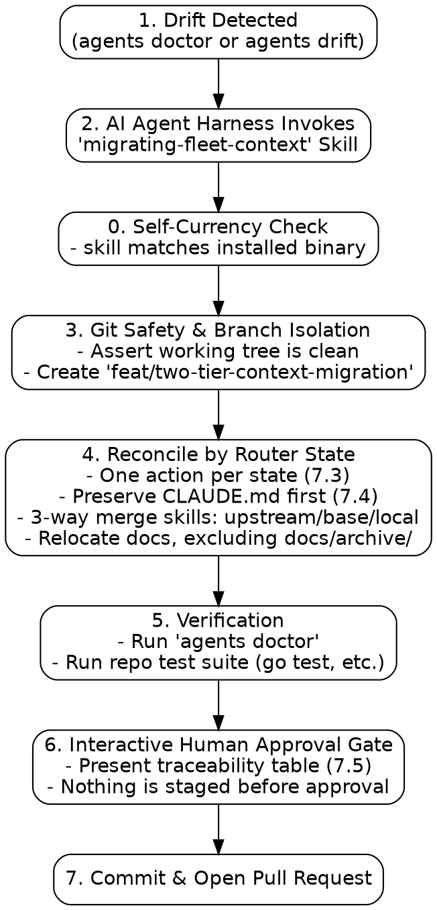

# Design: Two-Tier Agent Context and LLM-in-the-Loop Migration Architecture

**Date:** 2026-08-29 (Updated 2026-08-31; **amended 2026-09-01**, see Amendment 1)  
**Status:** Implemented 2026-08-31; §7 amended 2026-09-01 after the skill it specifies shipped contradicting it  
**Applies to:** `agents` CLI (`scaffold`, `drift`, `doctor`, `fleet`), `AGENTS.md` / `CLAUDE.md`, `.agents/AGENTS.md`, `.agents/skills/`, `.agents/skills/migrating-fleet-context/`  
**Depends on:** [Spec 1](2026-08-07-agents-repo-context-design.md) (harness adapters, exit codes), [Knowledge is Documentation](2026-08-19-knowledge-is-documentation.md) (2026-08-19), [Contributor Guardrails](2026-08-28-contributor-guardrails-and-scaffold-decoupling.md) (2026-08-28), [Binary Identity & Standalone Resolution](2026-08-28-binary-identity-and-standalone-resolution.md) (2026-08-28)  
**Reads against:** [`docs/qna/why-does-agents-init-never-update-existing-instructions.md`](../qna/why-does-agents-init-never-update-existing-instructions.md), [`docs/qna/how-does-two-tier-agent-context-prevent-scaffold-drift.md`](../qna/how-does-two-tier-agent-context-prevent-scaffold-drift.md)

---

## Amendment 1 — 2026-09-01

The `migrating-fleet-context` skill authored against §7 of this document shipped
contradicting the tooling it drives. The review is in
[`docs/journal/2026-09-01-why-the-migration-skill-shipped-hollow.md`](../journal/2026-09-01-why-the-migration-skill-shipped-hollow.md);
four of the defects traced to this spec rather than to the plan or the skill.
The corrections are applied in the body below. This section is the record of
what they replaced, because the spec is the design still in force and the
journal alone would not be read by the next author of the skill.

| § | Was | Now | Why |
|---|---|---|---|
| 7.1.4 | "Moves plan files (`*-plan.md` in `docs/journal/` **or `docs/archive/plans/`**) into `docs/plans/`" | archive is excluded from relocation, in the skill and in `internal/drift` alike | `.agents/AGENTS.md` declares `docs/archive/` strictly immutable and this store's own README says nothing in it is rewritten to stay true. §7.1 and §7.2 contradicted each other; §7.2 wins. |
| 7.1.4 | "Semantic 3-Way Un-Nesting" / "3-way merge", sources never named | §7.3 names the sources for each operation, and the root operation is renamed **semantic reconcile** | Three-way merge requires upstream, base and local. The root router operation has only two inputs, so it was never a 3-way merge; the skill merge has three and never said where they came from. An instruction an LLM can only guess at is not a specification. |
| 7.1 | Symlink handling assumed `CLAUDE.md` carries nothing | §7.4 requires reading and preserving `CLAUDE.md` before it is replaced | A legacy repository may hold its only copy of a domain rule in `CLAUDE.md`. The skill's `rm -f CLAUDE.md` deleted it with no extraction step. |
| 7.2 | "Zero Rule Dropping" asserted with no mechanism | §7.5 requires a traceability table, and makes an unclassifiable block a stop-and-ask | An invariant with no verification is a hope. This is the failure the spec says deterministic tools cannot handle, so the LLM path needs stronger proof than they get, not weaker. |
| 4.2 | every directory under `.agents/skills/` classified, unrecognised ones as `customized` | only embedded skills are classified; repository-specific skills are listed in a new `local_skills` field and never judged | §2 says `.agents/skills/` is where repository-specific skills belong, so classifying them made a repository dirty for using the feature as designed — and no migration could clear it, because there was nothing to fix. `playground/autogo-mlx` carries two and could not report clean. The tool owns what it embeds. |
| 6 | `scaffold:skill-migrating` — `warn` (missing or outdated) | unchanged as written; `doctor.go` implemented `customized` as `ok` and is corrected to `warn` | The skill is 100% `agents`-owned per §5.1. For an authoritative asset, "customized" *is* "outdated" — reporting it `ok` means a stale migration skill passes its own health check. |

**Amendment 1a (2026-09-01, same day).** Executing the rewritten skill against
`cowork` immediately surfaced two more defects, both of which this spec had:
§7.1.1 ordered the self-refresh *before* the clean-tree preflight, which
deadlocks — the refresh dirties the tree the preflight then rejects; and the
remedy in §6 named `agents update --apply`, an invocation the CLI rejects with
`--all is required`. Both are corrected above. Neither would have been found by
reading: the first needs the steps run in order, the second needs the command
actually run.

Two further gaps were absent from this spec entirely and are added, not corrected:
**§7.6** (fleet mode and the `--all` output shape) and **§7.7** (legacy store
triage). Neither was in the plan either; see the journal for where each entered.

---

## 1. Executive Summary & Problem Formulation

### 1.1 The Deterministic Migration Dilemma
Earlier iterations of repository scaffolding treated `AGENTS.md` / `CLAUDE.md` as an immutable file (`writeIfAbsent`). As the `agents` ecosystem evolved (adding multi-harness support, contributor-friendly doctor checks, 4-store documentation layouts, and retiring outdated capture systems), updating existing repositories across the fleet encountered a fundamental limitation of deterministic programming:
- **Monolithic Mixing**: Repositories mixed infrastructural harness directives with custom, human-authored domain rules, test protocols, and language conventions in a single root file.
- **Deterministic Brittleness**: Blindly overwriting `AGENTS.md` clobbers human-authored domain rules. Conversely, refraining from touching the file freezes repositories on obsolete scaffold conventions. Regex/AST parsers cannot reliably disentangle domain rules from reworded or reordered scaffold text.
- **Skill Drift & Obsolescence**: Bundled agent skills (`recording-what-you-learn`) also evolve over time. If skills are frozen after initial scaffold, repositories miss upstream improvements; if overwritten blindly, local customizations are destroyed.
- **Documentation Directory Drift**: Conflicting defaults across agent tools led to plans drifting across `docs/journal/`, `docs/archive/plans/`, and `docs/superpowers/plans/`.

### 1.2 The First-Principles Solution: Two-Tier Context + Model A Migration
This specification establishes a robust **Two-Tier Agent Context Architecture** paired with a **Model A (CLI Engine of Truth + Agent Harness Migration Skill)** migration engine:
1. **Clean Separation of Concerns (Two-Tier Isolation)**:
   - **Tier 1 (Root Router)**: Standardized, lightweight router (~24 lines) at `AGENTS.md` (with `CLAUDE.md -> AGENTS.md` symlink) that directs agents to durable docs and domain rules, and conditionally invokes `agents doctor`.
   - **Tier 2 (Domain Context)**: Dedicated repository-specific guidelines stored in `.agents/AGENTS.md` and durable knowledge in `docs/` (`design/`, `plans/`, `journal/`, `qna/`).
2. **Deterministic CLI Engine of Truth**:
   - `agents/internal/scaffold/`: Embeds canonical starter assets via Go `embed.FS` and scaffolds full Two-Tier + 4-store skeleton on `agents init`.
   - `agents/internal/drift/`: Dedicated deterministic package classifying router and skill states (`clean_current`, `clean_legacy`, `customized`, `missing`).
   - `agents drift [--json]`: Machine-readable inspection interface emitting structured diagnostics for AI agents.
   - `agents doctor`: Granular diagnostic checks (`scaffold:router`, `scaffold:symlink`, `scaffold:domain`, `scaffold:skill-recording`, `scaffold:skill-migrating`).
   - `agents update`: Deterministic machine wiring and authoritative refresh of `agents`-owned infrastructural skills.
3. **Model A LLM-in-the-Loop Migration Engine (`migrating-fleet-context`)**:
   - An authoritative, 100% `agents`-owned agent skill embedded in the Go binary.
   - Executes inside AI agent harnesses (Antigravity, Claude Code, Codex) on a dedicated feature branch with git dirty checks, semantic reconcile of domain rules, three-way skill merges, document relocation, and an interactive human approval gate that blocks the commit.

---

## 2. The Two-Tier Context Architecture

```
Repository Root
├── AGENTS.md                              [Tier 1: Canonical Root Router]
├── CLAUDE.md -> AGENTS.md                 [Harness Compatibility Symlink]
│
├── docs/                                  [Durable Knowledge Tier]
│   ├── design/README.md                   (Living architecture & specs)
│   ├── plans/README.md                    (Step-by-step implementation plans)
│   ├── journal/README.md                  (Dated records of what happened & retros)
│   ├── qna/README.md                      (Topic-indexed findings & learnings)
│   └── archive/                           (Immutable historical records pre-2026-08-20)
│
└── .agents/
    ├── AGENTS.md                          [Tier 2: Domain Context Tier]
    │   └── (Engineering guidelines, style, safety rules, stack conventions)
    ├── skills/                            (Repo-specific executable agent skills)
    │   ├── recording-what-you-learn/      (Bundled canonical recording skill)
    │   └── migrating-fleet-context/       (Authoritative embedded migration skill)
    └── hooks.json                         (Machine-local wiring)
```

### 2.1 Tier 1: Canonical Root Router (`AGENTS.md`)
The root `AGENTS.md` is strictly identical across repositories in the fleet. It solves the **indirection hop** by presenting an un-ignorable **Bootstrap Protocol** in its preamble:

```markdown
# Agent context

Durable context for this repo lives in `docs/`. Read it before assuming;
it is the record, and this file is only the pointer to it.

- `docs/qna/` — answers indexed by the question you would ask again
- `docs/plans/` — implementation plans
- `docs/journal/` — dated record of what happened
- `docs/design/` — the design still in force

## Repository Architecture & Guidelines
- Domain engineering guidelines, commenting standards, and safety constraints
  are defined in `.agents/AGENTS.md`.
- Repo-specific procedures and skills are located in `.agents/skills/`.

## Machine Wiring
`.agents/` holds machine wiring and local skills. A hook cannot install itself
and a missing hook fails silently.
- If the `agents` CLI is installed, run `agents doctor` early and report any warnings before relying on this context.
- If `agents` is not installed on this machine, skip machine wiring checks and adhere directly to the repository instructions above.

Recording is covered by the global instruction and the `recording-what-you-learn`
skill; it is not repo-specific and is not restated here.
```

### 2.2 Tier 2: Domain Context (`.agents/AGENTS.md`)
Owned entirely by the repository maintainer. Contains:
- Tech stack requirements (e.g. Python `uv`, Go idioms, TypeScript rules).
- Safety constraints & test mandates (e.g. mandatory TDD, pre-commit checks).
- Architecture invariants and documentation guidelines.
- Harness execution constraints (e.g. shadowing platform native planning in favor of `/brainstorming` and `writing-plans`).

---

## 3. Bundled Skills Delivery & Asset Embedding (`embed.FS`)

To support standalone operation on contributor machines without requiring a local `dotfiles` checkout, `agents` embeds canonical starter templates directly in the Go binary using `//go:embed assets/*`:

```
agents/internal/scaffold/assets/
├── skills/
│   ├── recording-what-you-learn/
│   │   └── SKILL.md                       (Durable knowledge recording skill)
│   └── migrating-fleet-context/
│       └── SKILL.md                       (Authoritative Model A migration engine)
├── dotagents/
│   └── AGENTS.md                          (Starter Tier 2 domain context template)
└── docs/
    ├── design/README.md                   (Living architecture index)
    ├── plans/README.md                    (Step-by-step plans index)
    ├── journal/README.md                  (Chronological logs index)
    └── qna/README.md                      (Topic-indexed Q&A index)
```

### 3.1 Idempotent Scaffolding (`scaffold.Create`)
When `agents init <path>` is executed:
1. **Directory Tree**: Creates `.agents/skills/`, `.agents/`, and the 4-store `docs/` directories (`docs/design/`, `docs/plans/`, `docs/journal/`, `docs/qna/`).
2. **Non-Destructive File Population (`writeIfAbsent`)**:
   - Populates `.agents/skills/recording-what-you-learn/SKILL.md` from embedded assets.
   - Populates `.agents/skills/migrating-fleet-context/SKILL.md` from embedded assets.
   - Populates `.agents/AGENTS.md` with the starter domain template.
   - Populates `docs/{design,plans,journal,qna}/README.md` index files (ensuring git tracks directories without needing `.gitkeep`).
   - Populates root `AGENTS.md` (`DefaultAgentsMD`) and symlinks `CLAUDE.md -> AGENTS.md`.
   - Appends `.agents/** linguist-generated=true` to `.gitattributes`.
   - Appends local generated paths to `.git/info/exclude`.

---

## 4. Deterministic Drift Inspection Subsystem (`internal/drift`)

The `internal/drift` package provides pure, deterministic inspection without invoking external processes or network APIs.

### 4.1 Canonical Router & Skill Digest Catalog
Maintains SHA-256 digests of known canonical templates:
* **`CleanCurrent`**: Matches active `scaffold.DefaultAgentsMD` or current embedded skill version.
* **`CleanLegacy`**: Matches accepted historical canonical versions generated by earlier `agents` versions (e.g. 2026-08-20 single-bullet doctor template, 2026-08-28 two-bullet template pre-plans).
* **`Customized` / `Drifted`**: Modified with repository-specific custom rules, embedded domain content, or local edits.
* **`Missing`**: Component does not exist.

### 4.2 Data Model & JSON Schema (`DriftReport`)
```go
type RouterState string    // "clean_current" | "clean_legacy" | "drifted" | "missing"
type ComponentState string // "ok" | "clean_legacy" | "customized" | "missing"

type DriftReport struct {
    RepoPath       string            `json:"repo_path"`
    RouterState    RouterState       `json:"router_state"`
    SymlinkState   string            `json:"symlink_state"`   // "ok" | "broken" | "not_symlink" | "missing"
    DomainState    string            `json:"domain_state"`    // "ok" | "missing"
    Skills         map[string]string `json:"skills"`          // embedded skill_name -> ComponentState
    LocalSkills    []string          `json:"local_skills"`    // repo-specific skills: listed, never judged
    DocsStores     map[string]bool   `json:"docs_stores"`     // design, plans, journal, qna
    MisplacedDocs  []string          `json:"misplaced_docs"`  // e.g. plans living in docs/journal/
    Diff           string            `json:"diff,omitempty"`  // Unified diff against canonical router
}
```

### 4.3 The `agents drift` Subcommand
* **Usage**: `agents drift [--json] [--repo <path>] [--all]`
* **Human-Readable Mode (default)**: Prints a structured status table showing Router, Symlinks, Tier 2 domain, Bundled skills, Docs stores, and any diff against the canonical router.
* **JSON Mode (`--json`)**: Emits the structured `DriftReport` for consumption by AI agent skills.
* **Exit Codes**:
  - `0` (`exitcode.OK`): Repository is completely clean (`clean_current`).
  - `1` (`exitcode.Advisory`): Drift, legacy templates, or missing components detected.

---

## 5. Refined `agents update` & Machine Wiring

The `agents update` command has **one focused responsibility**: updating deterministic machine wiring and keeping `agents`-owned infrastructural skills synchronized with the installed binary.

### 5.1 Single-Responsibility Workflow
When running `agents update [--all] [--apply]`:
1. **Machine Hook Rewiring (`wire`)**: Synchronizes `.claude/settings.json`, `.codex/hooks.json`, and `.agents/hooks.json`.
2. **Infrastructural Skill Refresh**: Ensures 100% `agents`-owned infrastructural skills (`.agents/skills/migrating-fleet-context/SKILL.md`) match the embedded version in the running binary.
3. **Safe Router & Skill Boundary**:
   - `agents update` **NEVER** performs regex/string replacement on human domain content (`AGENTS.md`, `.agents/AGENTS.md`) or user-facing customizable skills (`recording-what-you-learn`).
   - If drift or outdated templates are detected, `agents update` emits an advisory:
     ```text
     advisory: repository context drift detected in <path>
     -> invoke the 'migrating-fleet-context' agent skill for interactive 3-way migration
     ```
   - Emits exit code `1` (`exitcode.Advisory`) whenever any repository requires LLM-assisted migration.

---

## 6. Enhanced `agents doctor` Diagnostics

Replaces the legacy generic `scaffold:doctor-instruction` with 5 granular checks powered by `internal/drift`:

| Check Name | Status `ok` | Status `warn` / `fail` / `info` | Remedy Message |
| :--- | :--- | :--- | :--- |
| `scaffold:router` | Matches `CleanCurrent` | `info` (legacy template) / `warn` (custom drift) | Run `migrating-fleet-context` skill to un-nest domain rules |
| `scaffold:symlink` | `CLAUDE.md` is relative symlink to `AGENTS.md` | `fail` (missing or regular file) | Run `agents init` or recreate symlink |
| `scaffold:domain` | `.agents/AGENTS.md` exists | `info` (missing) | Run `agents init` or create `.agents/AGENTS.md` |
| `scaffold:skill-recording` | `.agents/skills/recording-what-you-learn/` exists | `warn` (missing) | Run `agents init` to populate bundled skill |
| `scaffold:skill-migrating` | `.agents/skills/migrating-fleet-context/` exists | `warn` (missing or outdated) | Run `agents update --all --apply` to refresh infrastructure skill |

---

## 7. Model A LLM-in-the-Loop Migration Engine (`migrating-fleet-context`)

The `migrating-fleet-context` skill is an authoritative agent skill embedded in `agents/internal/scaffold/assets/skills/migrating-fleet-context/SKILL.md`.



### 7.1 Skill Operational Protocol
1. **Self-Currency Check**: The skill is an `agents`-owned asset (§5.1) and can be read stale. Before acting, confirm the running copy matches the installed binary — `agents doctor` reporting `scaffold:skill-migrating` as `ok`. This check is read-only; the *fix* writes to the working tree and therefore happens after branch isolation (§7.1.4a), not here.
2. **Target Discovery**: `agents ls` for the registered fleet, then `agents drift --json` for one repository or `agents drift --all --json` for the fleet. See §7.6 for the two output shapes.
3. **Git Safety Check**: Asserts the working tree is clean (`git status --porcelain`). Refuses to proceed if uncommitted changes exist.
4. **Branch Isolation**: Creates dedicated feature branch: `feat/two-tier-context-migration`.
4a. **Self-Refresh**: If §7.1.1 found the skill stale, `agents update --all --apply` now, then re-read the skill and restart from §7.1.2. `--all` is mandatory — the CLI rejects `agents update` without it, and `agents wire` does not refresh skills, so there is no single-repository form. The refresh therefore writes to every registered repository; the copy in this one belongs in the migration commit, and the others are reported and left alone.
5. **Root Context Reconcile**: One action per router state (§7.3), preserving `CLAUDE.md` content first (§7.4).
6. **Skill Merge & Docs Realignment**: Three-way merge of user-owned skills (§7.3), relocation of misplaced documents excluding `docs/archive/` (§7.1 amendment), triage of retired stores (§7.7).
7. **Verification Gate**: Executes `agents drift`, `agents doctor` and repository test suites (`go test ./...`).
8. **Interactive Human Approval Gate**: Presents the traceability table (§7.5) and a scoped `git diff --stat`. **The skill stops here and waits.** It does not stage or commit before an explicit human approval.
9. **Commit & Open Pull Request**: On approval, stages the exact changed paths, commits, pushes, and opens a PR via `gh`.

### 7.2 Invariant Guarantees
- **Zero Rule Dropping**: All domain constraints, test rules, and guidelines present in the original file are preserved in `.agents/AGENTS.md`, and the traceability table of §7.5 is what shows it.
- **Archive Immutability**: `docs/archive/` is neither written to nor moved out of. Relocation applies to the live stores only.
- **Branch Protection Compliance**: All migrations are authored on dedicated feature branches and merged via Pull Requests after passing CI gates.
- **No Unapproved Commit**: Steps 1-7 mutate the working tree; only step 9 touches the index, and only after step 8 returns approval.

### 7.3 Router State Table and Merge Sources

Migration is not one procedure. `internal/drift` classifies four router states
and each has a different correct action; treating them alike is what makes a
`clean_legacy` router get partitioned as though it held domain rules.

| `router_state` | Meaning | Action |
|---|---|---|
| `clean_current` | matches the running binary's `scaffold.DefaultAgentsMD` | no-op |
| `clean_legacy` | matches a known older canonical template, carries no custom content | replace wholesale; there is nothing to extract |
| `drifted` | canonical text plus, or reworded into, repository content | semantic reconcile (below), then restore the canonical router |
| `missing` | no root `AGENTS.md` | do not invent one; inspect `CLAUDE.md` (§7.4), and if it too is absent, stop and ask |

Two distinct operations were both called "3-way merge". They are not the same
shape and only one of them is a merge:

- **Semantic reconcile (root router)** — two inputs: the current root file, and
  the canonical router from the running binary. Output: domain rules moved to
  `.agents/AGENTS.md`, canonical router restored. Two inputs is not a three-way
  merge and calling it one invited an operation nobody had defined.
- **Three-way merge (user-owned skills, e.g. `recording-what-you-learn`)** —
  three inputs, named explicitly: **upstream** is the embedded asset in the
  running binary; **base** is the canonical or legacy template the local file
  last matched, identified by the digest catalog of §4.1; **local** is the
  working file. Where the digest catalog cannot identify a base, there is no
  three-way merge available — stop and ask rather than guessing one.

### 7.4 Root File Preservation

`CLAUDE.md` becomes a symlink, which destroys whatever it held. Before
`ln -s AGENTS.md CLAUDE.md`:

1. `stat` both paths before reading either. Three topologies exist in the
   fleet today and they are not interchangeable:

   | Topology | Meaning | Handling |
   |---|---|---|
   | `AGENTS.md` regular, `CLAUDE.md -> AGENTS.md` | current | nothing to preserve |
   | `AGENTS.md` regular, `CLAUDE.md` regular | both carry content | reconcile both (step 2) |
   | **`AGENTS.md -> CLAUDE.md`, `CLAUDE.md` regular** | **inverted**, the pre-2026-08-19 Spec 1 topology | see below |

2. If both exist as regular files and differ, treat **both** as sources of
   domain rules. A legacy repository may hold its only copy of a rule in
   `CLAUDE.md`.

3. **The inverted case is destructive if handled blind.** Where `AGENTS.md` is
   a symlink *to* `CLAUDE.md`, the sequence `rm -f CLAUDE.md && ln -s AGENTS.md
   CLAUDE.md` deletes the only real file and leaves `AGENTS.md -> CLAUDE.md ->
   AGENTS.md`: a symlink loop, and every line of repository context gone.
   Invert deliberately instead — read `CLAUDE.md`, remove the `AGENTS.md`
   symlink, write the reconciled content to `AGENTS.md` as a regular file, then
   replace `CLAUDE.md` with the symlink.

   `playground/desktop_pet` is in exactly this state as of 2026-09-01:
   `AGENTS.md -> CLAUDE.md`, 18 lines of real content in `CLAUDE.md`,
   `symlink_state: not_symlink`, `domain_state: missing`.

4. Extract to `.agents/AGENTS.md` first. Replace with the symlink only once the
   content has a destination.

### 7.5 Traceability Requirement

Zero Rule Dropping is not verifiable by inspection of the result. Before the
approval gate the skill produces a table over every non-boilerplate block in the
source files:

```
source quote (verbatim) -> classification -> destination
```

Every block reaches exactly one destination: `.agents/AGENTS.md`, the canonical
router (as boilerplate being replaced), or a named `docs/` store. A block that
cannot be confidently classified, or that has two plausible destinations, is a
**stop-and-ask** — not a judgement call the skill makes alone. The table goes to
the human in step 8; it is the evidence for the invariant, and without it the
invariant is an assertion.

### 7.6 Fleet Mode and Output Shapes

`agents drift --json` and `agents drift --all --json` do not return the same
JSON type, and a consumer written against one breaks on the other:

| Invocation | Returns |
|---|---|
| `agents drift --json` | a single `DriftReport` **object** |
| `agents drift --all --json` | an **array** of `DriftReport` |

Fleet mode iterates the array with per-repository branch isolation. Registry
entries reported `missing` or `unknown`, and repositories with a dirty working
tree, are skipped and named in the final report rather than migrated.

### 7.7 Retired Store Triage

Repositories predating the 2026-08-19 redesign may carry `.agents/memory/` and
`.agents/reports/`. These are **not** relocated wholesale: much of their content
is machine-generated and belongs nowhere. Durable findings move to the store
that matches their retrieval axis — `docs/qna/` for a topic-indexed finding,
`docs/design/` for a design still in force, `docs/plans/` for an unexecuted
plan. Everything else is dropped, and what was dropped is named in the report to
the human.

---

## 8. Multi-Harness Integration & Platform Workflow Shadowing

### 8.1 Symlink Protocol
- **Canonical Root Entry**: `AGENTS.md` is the regular file at repository root.
- **Claude Code Compatibility**: `CLAUDE.md` is a relative symlink pointing to `AGENTS.md` (`ln -s AGENTS.md CLAUDE.md`).
- **Antigravity Compatibility**: Antigravity natively discovers root `AGENTS.md`, `.agents/AGENTS.md`, and `.agents/skills/`.
- **Codex / Cursor Compatibility**: Configured via machine-local harness wiring generated by `agents wire`.

### 8.2 Shadowing Native Platform Planning Workflows
To prevent AI harnesses (such as Antigravity) from intercepting workflows with modal platform prompts or transient brain artifacts:
- All architectural specs are written directly to `docs/design/YYYY-MM-DD-<topic>-design.md`.
- All implementation plans are written directly to `docs/plans/YYYY-MM-DD-<topic>-plan.md`.
- Transient brain artifacts are avoided or authored without `RequestFeedback: true`, maintaining conversational flow and human approval in chat via `/brainstorming` and `writing-plans`.

---

## 9. Documentation & CLI Maintenance Invariants

> [!IMPORTANT]
> **CLI Interface Documentation Invariant**  
> Whenever any `agents` CLI command, subcommand, flag, or invocation interface is added, modified, or deprecated, all corresponding documentation MUST be updated in the same change set:
> 1. `agents/README.md` (Features, Quickstart, and CLI Reference table)
> 2. Root `README.md`
> 3. CLI built-in help text (`agents help`)
> 4. Applicable design docs and Q&A entries in `docs/`

---

## 10. Adoption & Phasing Roadmap

1. **Phase 1: Asset Embedding & Scaffold Completion** (`internal/scaffold/assets/`):
   - Embed `recording-what-you-learn`, `migrating-fleet-context`, `.agents/AGENTS.md` starter template, and `docs/` store READMEs.
   - Update `scaffold.Create` to populate full 4-store skeleton and skills.
2. **Phase 2: Drift Subsystem & Doctor Diagnostics** (`internal/drift/`, `cmd_drift.go`, `internal/doctor/`):
   - Implement canonical digest catalog and `DriftReport` schema.
   - Implement `agents drift [--json]` CLI command.
   - Add granular `scaffold:*` doctor checks.
3. **Phase 3: Refined `agents update`** (`cmd_fleet.go`):
   - Implement single-responsibility wiring + `migrating-fleet-context` skill refresh.
   - Wire exit code 1 advisory for drifted repositories.
4. **Phase 4: Model A Migration Skill Authoring** (`.agents/skills/migrating-fleet-context/`):
   - Author authoritative skill markdown in `dotfiles` and embed into binary.
   - Test migration end-to-end on drifted/legacy repositories.
