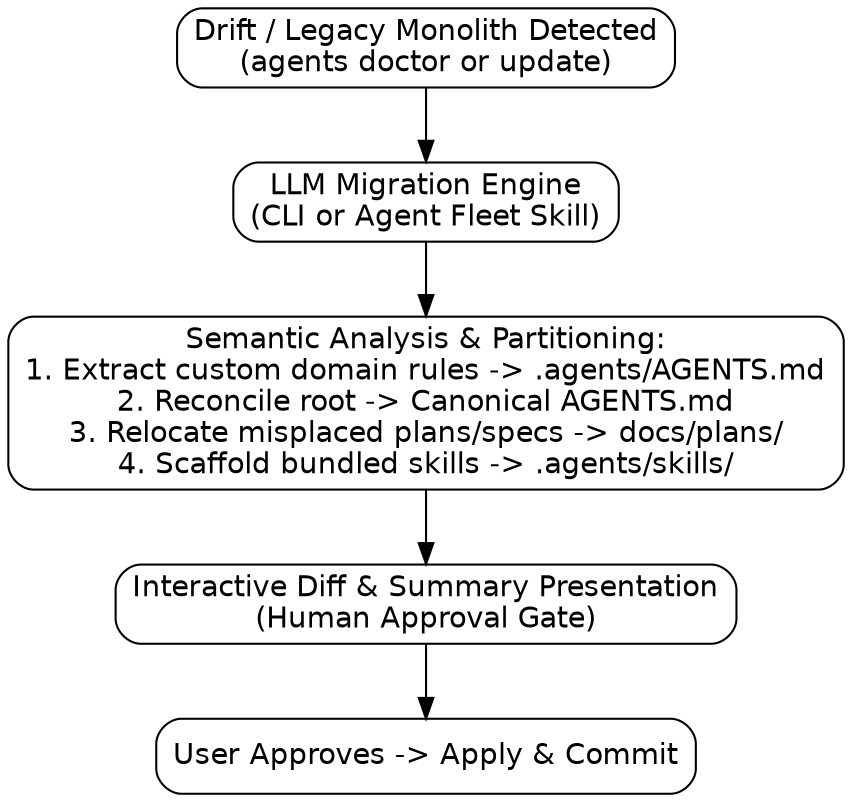

# Design: Two-Tier Agent Context and LLM-in-the-Loop Migration Architecture

**Date:** 2026-08-29  
**Status:** Approved in Brainstorming  
**Applies to:** `agents` CLI, `scaffold` package, `doctor` subsystem, `AGENTS.md` / `CLAUDE.md`, `.agents/AGENTS.md`, `.agents/skills/`, fleet migration skills  
**Depends on:** [Spec 1](2026-08-07-agents-repo-context-design.md) (harness adapters, exit codes), [Knowledge is Documentation](2026-08-19-knowledge-is-documentation.md) (2026-08-19), [Contributor Guardrails](2026-08-28-contributor-guardrails-and-scaffold-decoupling.md) (2026-08-28)  
**Reads against:** [`docs/qna/why-does-agents-init-never-update-existing-instructions.md`](../qna/why-does-agents-init-never-update-existing-instructions.md)

---

## 1. Executive Summary & Problem Formulation

### 1.1 The Deterministic Migration Dilemma
Earlier iterations of repository scaffolding treated `AGENTS.md` / `CLAUDE.md` as an immutable file (`writeIfAbsent`). As the `agents` ecosystem evolved (adding multi-harness support, contributor-friendly doctor checks, and retiring outdated capture systems), updating existing repositories across the fleet encountered a fundamental limitation of deterministic programming:
- **Monolithic Mixing**: Repositories often mixed infrastructural harness directives with custom, human-authored domain rules, test protocols, and language conventions in a single root file.
- **Deterministic Brittleness**: Blindly overwriting `AGENTS.md` clobbers human-authored domain rules. Conversely, refraining from touching the file freezes repositories on obsolete scaffold conventions. Regex/AST parsers cannot reliably disentangle domain rules from reworded or reordered scaffold text.
- **Documentation Directory Drift**: Conflicting defaults across agent tools and plugins led to plans drifting across `docs/journal/`, `docs/archive/plans/`, and `docs/superpowers/plans/`.

### 1.2 The First-Principles Solution
This specification establishes a robust **Two-Tier Agent Context Architecture** paired with an **LLM-in-the-Loop Migration Engine**:
1. **Clean Separation of Concerns (Two-Tier Isolation)**:
   - **Tier 1 (Root Router)**: Standardized, lightweight router (~35 lines) at `AGENTS.md` / `CLAUDE.md` that directs agents to durable docs and domain rules, and conditionally invokes `agents doctor`.
   - **Tier 2 (Domain Context)**: Dedicated repository-specific guidelines stored in `.agents/AGENTS.md` and durable knowledge in `docs/` (`design/`, `plans/`, `journal/`, `qna/`).
2. **Explicit 4-Store Documentation Layout**:
   - `docs/design/` — Living architectural specifications.
   - `docs/plans/` — Step-by-step implementation plans.
   - `docs/journal/` — Dated chronological session records and run retrospective logs.
   - `docs/qna/` — Topic/question-indexed findings.
   - `docs/archive/` — Strictly immutable historical archive for executed plans and retired specs prior to 2026-08-20.
3. **Deterministic Fast-Path + LLM-Assisted Migration**:
   - `agents doctor` and `agents update` deterministically recognize canonical Tier 1 router templates.
   - For repositories with legacy monolithic files or custom drift in root `AGENTS.md`, an **LLM-in-the-loop migration engine** (available via CLI and an agent skill) semantically un-nests domain rules into `.agents/AGENTS.md`, restores the canonical root router, relocates drifted documents, and presents an interactive diff proposal for explicit **human approval**.
4. **Self-Contained Bundled Skills**:
   - `agents` embeds the canonical `recording-what-you-learn` skill via Go `embed.FS` and scaffolds it into `.agents/skills/recording-what-you-learn/` on `agents init` / `agents update`, ensuring standalone repositories on external contributor machines function with zero missing skill references.

---

## 2. The Two-Tier Context Architecture

```
Repository Root
├── AGENTS.md                              [Tier 1: Canonical Root Router]
├── CLAUDE.md -> AGENTS.md                 [Harness Compatibility Symlink]
│
├── docs/                                  [Durable Knowledge Tier]
│   ├── design/                            (Living architecture & specs)
│   ├── plans/                             (Step-by-step implementation plans)
│   ├── journal/                           (Dated records of what happened & retros)
│   ├── qna/                               (Topic-indexed findings & learnings)
│   └── archive/                           (Immutable historical records pre-2026-08-20)
│
└── .agents/
    ├── AGENTS.md                          [Tier 2: Domain Context Tier]
    │   └── (Engineering guidelines, style, safety rules, stack conventions)
    ├── skills/                            (Repo-specific executable agent skills)
    │   └── recording-what-you-learn/      (Bundled canonical recording skill)
    └── hooks.json                         (Machine-local wiring)
```

### 2.1 Tier 1: Canonical Root Router (`AGENTS.md`)
The root `AGENTS.md` is strictly identical across repositories in the fleet. It solves the **indirection hop** by presenting an un-ignorable **Bootstrap Protocol** in its preamble:

```markdown
# Agent context

Durable context for this repo lives in `docs/`. Read it before assuming;
it is the record, and this file is only the pointer to it.

- `docs/qna/` — answers indexed by the question you would ask again
- `docs/plans/` — implementation plans
- `docs/journal/` — dated record of what happened
- `docs/design/` — the design still in force

## Repository Architecture & Guidelines
- Domain engineering guidelines, commenting standards, and safety constraints
  are defined in `.agents/AGENTS.md`.
- Repo-specific procedures and skills are located in `.agents/skills/`.

## Machine Wiring
`.agents/` holds machine wiring and local skills. A hook cannot install itself
and a missing hook fails silently.
- If the `agents` CLI is installed, run `agents doctor` early and report any warnings before relying on this context.
- If `agents` is not installed on this machine, skip machine wiring checks and adhere directly to the repository instructions above.

Recording is covered by the global instruction and the `recording-what-you-learn`
skill; it is not repo-specific and is not restated here.
```

### 2.2 Tier 2: Domain Context (`.agents/AGENTS.md`)
Owned entirely by the repository maintainer. Contains:
- Tech stack requirements (e.g. Python `uv`, Go idioms, TypeScript rules).
- Safety constraints & test mandates (e.g. mandatory TDD, pre-commit checks).
- Architecture invariants and documentation guidelines.
- Agent harness and workflow guidelines (e.g. shadowing platform native planning in favor of `/brainstorming` and `writing-plans`).

---

## 3. CLI Diagnostics & Deterministic Drift Detection

The `agents` CLI uses static digests to detect scaffold drift:

1. **`agents doctor` Diagnostic Checks**:
   - `scaffold:router`: Checks whether root `AGENTS.md` matches the canonical router template (or an accepted legacy canonical version). Emits an advisory if custom content has accumulated in root.
   - `scaffold:symlink`: Verifies `CLAUDE.md` is a relative symlink pointing to `AGENTS.md`.
   - `scaffold:domain`: Reports `ok` if `.agents/AGENTS.md` is present, or `info` if absent.
   - `scaffold:skill-recording`: Reports `ok` if `.agents/skills/recording-what-you-learn` exists.
2. **Deterministic Fast-Path in `agents update`**:
   - When running `agents update --all [--apply]`, if a repository's root `AGENTS.md` matches a known clean canonical router version, it is updated in-place deterministically with zero LLM overhead.

---

## 4. LLM-in-the-Loop Migration Engine

When a repository contains a legacy monolithic `AGENTS.md` or has drifted custom content in root:



### 4.1 Invocation Models
1. **Interactive CLI (`agents migrate` / `agents update --instructions`)**:
   - Compares the current root `AGENTS.md` against canonical `DefaultAgentsMD`.
   - Sends the diff and file contents to the LLM backend.
   - Outputs a colored interactive diff in the terminal:
     - Proposed `.agents/AGENTS.md` (extracted domain rules).
     - Proposed `AGENTS.md` (standardized router).
   - Prompts for human confirmation `[y/N/e]` before writing.
2. **Autonomous Fleet Migration Skill**:
   - Specialized agent skill for Antigravity / Claude Code to traverse registered fleet repositories (`agents ls`), perform the two-tier un-nesting, relocate drifted plan/spec files into `docs/plans/` and `docs/design/`, run verification, and open PRs with structured summaries.

### 4.2 Invariant Guarantees
- **Zero Rule Dropping**: The LLM engine must assert that all domain constraints, test rules, and guidelines present in the original file are preserved in `.agents/AGENTS.md`.
- **Preservation of Existing `.agents/AGENTS.md`**: In repositories where `.agents/AGENTS.md` already exists (e.g. `autogo-mlx`), the tool preserves existing domain content and avoids duplication.
- **Archive Immutability**: Active work and modern plans are never written to `docs/archive/`.
- **Human Approval Gate**: Never write or commit without explicit user confirmation.

---

## 5. Bundled Skills Delivery (`recording-what-you-learn`)

To support standalone operation without requiring a global `dotfiles` clone on collaborator machines:
1. **Embedding**: The `recording-what-you-learn` skill markdown is embedded into the `agents` Go binary via `embed.FS` in `agents/internal/scaffold/assets/`.
2. **Scaffolding**: `scaffold.Create` (invoked during `agents init` or `agents update`) ensures `.agents/skills/recording-what-you-learn/SKILL.md` is populated.
3. **Multi-Harness Exposure**: Existing `agents wire` mechanics automatically symlink `.claude/skills -> ../.agents/skills` and `.codex/skills -> ../.agents/skills`, while Antigravity natively reads `.agents/skills/`.

---

## 6. Multi-Harness Integration & Platform Workflow Shadowing

### 6.1 Symlink Protocol
- **Canonical Root Entry**: `AGENTS.md` is the regular file at repository root.
- **Claude Code Compatibility**: `CLAUDE.md` is a relative symlink pointing to `AGENTS.md` (`ln -s AGENTS.md CLAUDE.md`).
- **Antigravity Compatibility**: Antigravity natively discovers root `AGENTS.md`, `.agents/AGENTS.md`, and `.agents/skills/`.
- **Codex / Cursor Compatibility**: Configured via machine-local harness wiring generated by `agents wire`.

### 6.2 Shadowing Native Platform Planning Workflows
To prevent AI harnesses (such as Antigravity) from intercepting workflows with modal platform prompts or transient brain artifacts:
- All architectural specs are written directly to `docs/design/YYYY-MM-DD-<topic>-design.md`.
- All implementation plans are written directly to `docs/plans/YYYY-MM-DD-<topic>-plan.md`.
- Transient brain artifacts are avoided or authored without `RequestFeedback: true`, maintaining conversational flow and human approval in chat via `/brainstorming` and `writing-plans`.

---

## 7. Documentation & CLI Maintenance Invariants

> [!IMPORTANT]
> **CLI Interface Documentation Invariant**  
> Whenever any `agents` CLI command, subcommand, flag, or invocation interface is added, modified, or deprecated, all corresponding documentation MUST be updated in the same change set:
> 1. `agents/README.md` (Features, Quickstart, and CLI Reference table)
> 2. Root `README.md`
> 3. CLI built-in help text (`agents help`)
> 4. Applicable design docs and Q&A entries in `docs/`

---

## 8. Concrete Adoption for `dotfiles`

To align the `dotfiles` repository with this architecture:
1. **Directory Structure Realignment**:
   - Create `docs/plans/` directory and `docs/plans/README.md`.
   - Move all 2026-08-28 implementation plans from `docs/journal/` to `docs/plans/`.
   - Move `docs/archive/plans/2026-08-28-antigravity-multi-harness-onboarding.md` to `docs/plans/2026-08-28-antigravity-multi-harness-onboarding-plan.md` and fix internal relative links.
   - Update `docs/journal/README.md` to clarify the separation between plans and journals.
2. **Invert Root Symlink**:
   - Replace `CLAUDE.md` with `AGENTS.md` as the regular file.
   - Symlink `CLAUDE.md -> AGENTS.md`.
3. **Update Root `AGENTS.md`**:
   - Align with `scaffold.DefaultAgentsMD` (incorporating `docs/plans/`, conditional doctor, pointers to `.agents/AGENTS.md` and `docs/`).
4. **Create `dotfiles/.agents/AGENTS.md`**:
   - Populate with dotfiles-specific engineering guidelines, 4-store docs conventions, archive immutability, shell scripting standards, and the CLI documentation maintenance invariant.
5. **Update Go Scaffold Template**:
   - Update `DefaultAgentsMD` in `agents/internal/scaffold/scaffold.go` and corresponding tests in `scaffold_test.go`.
6. **Machine Wiring & Verification**:
   - Run `agents wire` to update `.claude/settings.json`, `.codex/hooks.json`, and `.agents/hooks.json`.
   - Run `agents doctor` and `go test ./agents/...`.
