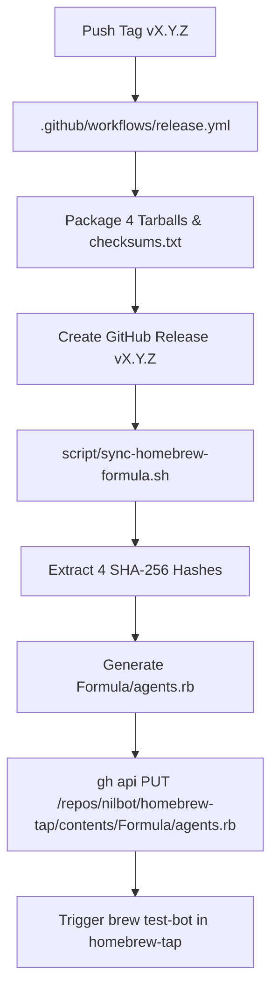

# Automated Release & Homebrew Tap Synchronization Implementation Plan

> **For agentic workers:** REQUIRED SUB-SKILL: Use superpowers:subagent-driven-development to implement this plan task-by-task. Steps use checkbox (`- [ ]`) syntax for tracking.

**Goal:** Build a zero-clone, automated release and Homebrew formula synchronization pipeline that extracts cryptographic SHA-256 digests from `dist/checksums.txt`, renders `Formula/agents.rb`, and commits directly to `nilbot/homebrew-tap` via the GitHub Contents REST API on release tag pushes.

**Architecture:** A standalone bash script (`script/sync-homebrew-formula.sh`) parses platform digests from `checksums.txt`, formats the Ruby formula according to Homebrew standards, and pushes to `nilbot/homebrew-tap` using `gh api PUT /repos/nilbot/homebrew-tap/contents/Formula/agents.rb` without git cloning. The script is called by `.github/workflows/release.yml` after GitHub Release publishing.

**Architecture Diagram:**



**Tech Stack:** Bash, GitHub CLI (`gh`), GitHub REST API, Homebrew Ruby DSL

**Spec:** [`docs/design/2026-08-28-automated-release-and-homebrew-tap-sync.md`](../design/2026-08-28-automated-release-and-homebrew-tap-sync.md)

## Global Constraints

- Action pinning: All workflow actions must remain pinned to immutable commit SHAs.
- Zero git clones for tap sync: Formula updates to `nilbot/homebrew-tap` must use the GitHub Contents REST API via `gh api`.
- Multi-arch coverage: Must extract and validate all 4 platform digests (`darwin/arm64`, `darwin/amd64`, `linux/arm64`, `linux/amd64`).
- Dry-run capability: Script must execute cleanly in local offline test mode when `HOMEBREW_TAP_TOKEN` is unset.

---

### Task 1: Create Formula Synchronization Script (`script/sync-homebrew-formula.sh`)

**Files:**
- Create: `script/sync-homebrew-formula.sh` (chmod +x)

**Interfaces:**
- `script/sync-homebrew-formula.sh <VERSION> [DIST_DIR]`:
  - `VERSION`: e.g. `v0.2.0` or `0.2.0` (strips leading `v`).
  - `DIST_DIR`: directory containing `checksums.txt` (defaults to `${ROOT_DIR}/dist`).
  - Extracts 4 hashes from `checksums.txt`:
    - `DARWIN_ARM64_SHA`: `agents_${VERSION}_darwin_arm64.tar.gz`
    - `DARWIN_AMD64_SHA`: `agents_${VERSION}_darwin_amd64.tar.gz`
    - `LINUX_ARM64_SHA`: `agents_${VERSION}_linux_arm64.tar.gz`
    - `LINUX_AMD64_SHA`: `agents_${VERSION}_linux_amd64.tar.gz`
  - Validates all 4 are 64-character hex strings (`^[0-9a-f]{64}$`).
  - Generates `Formula/agents.rb` in repository root.
  - If `GH_TOKEN` or `HOMEBREW_TAP_TOKEN` is set:
    - Queries remote file SHA: `gh api repos/nilbot/homebrew-tap/contents/Formula/agents.rb --jq '.sha' 2>/dev/null || echo ""`
    - Encodes formula: `base64 -i Formula/agents.rb 2>/dev/null || base64 -w 0 Formula/agents.rb`
    - Pushes:
      ```bash
      gh api --method PUT \
        -H "Accept: application/vnd.github+json" \
        repos/nilbot/homebrew-tap/contents/Formula/agents.rb \
        -f message="feat(agents): update formula to v${VERSION}" \
        -f content="${CONTENT_B64}" \
        ${FILE_SHA:+-f sha="${FILE_SHA}"}
      ```
  - If token not set: prints dry-run notice and exits 0.

- [ ] **Step 1: Write `script/sync-homebrew-formula.sh`**
- [ ] **Step 2: Make executable (`chmod +x script/sync-homebrew-formula.sh`)**
- [ ] **Step 3: Test dry-run with synthetic checksums directory**
- [ ] **Step 4: Verify generated `Formula/agents.rb` with `ruby -c`**
- [ ] **Step 5: Commit**

```bash
git add script/sync-homebrew-formula.sh
git commit -m "feat(release): add automated Homebrew formula synchronizer script"
```

---

### Task 2: Integrate Formula Sync into `.github/workflows/release.yml`

**Files:**
- Modify: `.github/workflows/release.yml`

**Interfaces:**
- Adds step after `Create GitHub Release`:
  ```yaml
      - name: sync formula to homebrew-tap
        if: env.HOMEBREW_TAP_TOKEN != ''
        env:
          GH_TOKEN: ${{ secrets.HOMEBREW_TAP_TOKEN }}
          HOMEBREW_TAP_TOKEN: ${{ secrets.HOMEBREW_TAP_TOKEN }}
        run: |
          bash script/sync-homebrew-formula.sh "${{ steps.version.outputs.version }}" dist
  ```

- [ ] **Step 1: Update `.github/workflows/release.yml`**
- [ ] **Step 2: Validate YAML syntax**
- [ ] **Step 3: Commit**

```bash
git add .github/workflows/release.yml
git commit -m "feat(ci): add automated formula sync step to release workflow"
```

---

### Task 3: Full Subsystem Verification & Whole-Branch Review

**Files:**
- Test: Full repository test suite in `agents/` and `bootstrap.d/`

- [ ] **Step 1: Run `gofmt -d .` and `go vet ./...` across all packages**
- [ ] **Step 2: Run `go test -count=1 ./...` across `agents/` and `bootstrap.d/`**
- [ ] **Step 3: Test end-to-end package & formula sync dry-run**
- [ ] **Step 4: Final whole-branch review**
