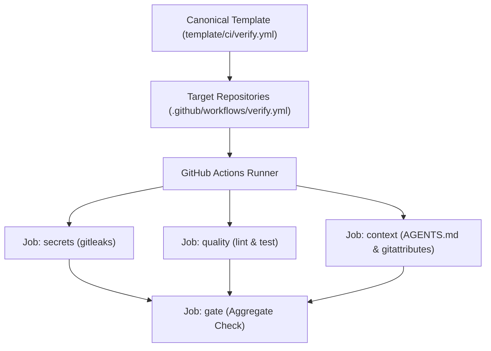

# Authoritative CI Verification Gate Template Implementation Plan (Phase 4)

> **For agentic workers:** REQUIRED SUB-SKILL: Use superpowers:subagent-driven-development to implement this plan task-by-task. Steps use checkbox (`- [ ]`) syntax for tracking.

**Goal:** Create a hardened, reusable GitHub Actions verification workflow template (`template/ci/verify.yml`) for collaborator repositories, providing unbypassable CI enforcement (Gitleaks secret scanning, linter/test gate, context integrity, and aggregate `gate` check), and demonstrate adoption in `toolshed/cowork`.

**Architecture:** Maintain the canonical workflow template in `template/ci/verify.yml` with commit-pinned GitHub Actions, secret scanning, quality checks, and aggregate `gate` job. Provide adoption guidance and apply the template to `toolshed/cowork`.

**Architecture Diagram:**



**Tech Stack:** GitHub Actions YAML, Gitleaks, Shell

**Spec:** [`docs/design/2026-08-28-authoritative-ci-verification-gate-template.md`](../design/2026-08-28-authoritative-ci-verification-gate-template.md)

## Global Constraints

- Action pinning: All actions must be pinned to immutable commit SHAs with version comments.
- Zero secrets leakage: Gitleaks must run against full PR history (`fetch-depth: 0`).
- Gate integrity: `gate` job must depend on all validation jobs with `if: always()`.

---

### Task 1: Create Canonical CI Verification Template

**Files:**
- Create: `template/ci/verify.yml`
- Create: `template/ci/README.md`

**Interfaces:**
- `template/ci/verify.yml`:
  - `on: [push (branches: [master, main]), pull_request, workflow_dispatch]`
  - `permissions: contents: read`
  - `secrets` job: installs checksum-verified Gitleaks and scans repo commits.
  - `quality` job: template steps for language linting and test execution.
  - `context` job: asserts `AGENTS.md` presence and `.gitattributes` configuration.
  - `gate` job: required aggregate check.
- `template/ci/README.md`:
  - Instructions for adopting and configuring for Go, Python, and Node/Web projects.

- [ ] **Step 1: Write `template/ci/verify.yml`**
- [ ] **Step 2: Write `template/ci/README.md`**
- [ ] **Step 3: Validate YAML syntax**
- [ ] **Step 4: Commit**

```bash
git add template/ci/
git commit -m "feat(template): add canonical CI verification gate workflow template"
```

---

### Task 2: Apply Template to `toolshed/cowork`

**Files:**
- Modify: `/Users/nilbot/devel/nilbot.net/toolshed/cowork/.github/workflows/verify.yml`

- [ ] **Step 1: Create `.github/workflows/verify.yml` in `cowork`**
- [ ] **Step 2: Validate YAML syntax in `cowork`**
- [ ] **Step 3: Commit in `cowork`**

---

### Task 3: Full Verification & Whole-Branch Review

- [ ] **Step 1: Run formatting and static analysis in `dotfiles` (`gofmt -d .`, `go vet ./...`)**
- [ ] **Step 2: Run full test suite in `dotfiles` (`go test -count=1 ./...`)**
- [ ] **Step 3: Verify all workflows and documentation**
