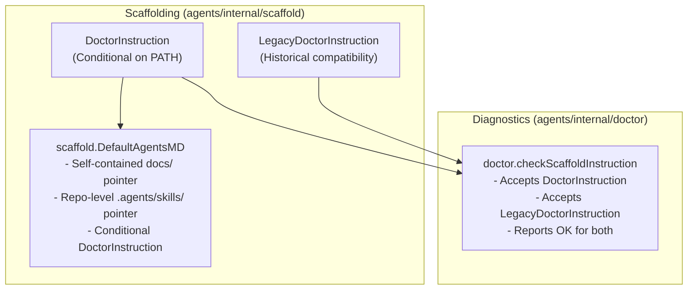

# Contributor Guardrails and Scaffold Decoupling Implementation Plan (Phase 1)

> **For agentic workers:** REQUIRED SUB-SKILL: Use superpowers:subagent-driven-development to implement this plan task-by-task. Steps use checkbox (`- [ ]`) syntax for tracking.

**Goal:** Update `scaffold.DefaultAgentsMD` and `scaffold.DoctorInstruction` so newly scaffolded repositories provide self-contained, contributor-friendly guidance to coding agents without reporting false broken-setup failures when external collaborators lack `agents` or `dotfiles`.

**Architecture:** Define `LegacyDoctorInstruction` alongside an updated conditional `DoctorInstruction` in `agents/internal/scaffold`. Update `DefaultAgentsMD` to remove the strict setup failure alarm. Enhance `doctor.checkScaffoldInstruction` in `agents/internal/doctor` to recognize both current and legacy instruction markers, preserving backwards compatibility across the existing fleet.

**Architecture Diagram:**



**Tech Stack:** Go 1.24+, `testing`, `os`, `path/filepath`, `strings`

**Spec:** [`docs/design/2026-08-28-contributor-guardrails-and-scaffold-decoupling.md`](../design/2026-08-28-contributor-guardrails-and-scaffold-decoupling.md)

## Global Constraints

- `scaffold.Create` must remain strictly idempotent and never overwrite or mutate existing `AGENTS.md` or `CLAUDE.md` files.
- `doctor.checkScaffoldInstruction` must maintain backwards compatibility: repositories carrying the legacy instruction must continue to report `ok`.
- Every test must use isolated temp directories (`t.TempDir()`).
- All tests in `agents/...` must pass cleanly without regressions.

---

### Task 1: Update `scaffold.DefaultAgentsMD` and `scaffold.DoctorInstruction`

**Files:**
- Modify: [`agents/internal/scaffold/scaffold.go`](file:///Users/nilbot/dotfiles/agents/internal/scaffold/scaffold.go)
- Modify: [`agents/internal/scaffold/scaffold_test.go`](file:///Users/nilbot/dotfiles/agents/internal/scaffold/scaffold_test.go)

**Interfaces:**
- `scaffold.LegacyDoctorInstruction`: `const LegacyDoctorInstruction = "Run \`agents doctor\` early and report any warnings before relying on this context."`
- `scaffold.DoctorInstruction`: `const DoctorInstruction = "If the \`agents\` CLI is installed, run \`agents doctor\` early and report any warnings before relying on this context. If \`agents\` is not installed on this machine, skip machine wiring checks and adhere directly to the repository instructions above."`
- `scaffold.DefaultAgentsMD`: root instruction template incorporating conditional `DoctorInstruction` and without the broken-setup alarm sentence.

- [ ] **Step 1: Write failing test in `scaffold_test.go`**

Add test assertions verifying the new `DoctorInstruction` wording and confirming `DefaultAgentsMD` no longer contains `"an empty or stale .agents/ means the setup is broken"`.

```go
func TestDefaultAgentsMDContributorFriendly(t *testing.T) {
	if strings.Contains(DefaultAgentsMD, "an empty or stale `.agents/` means the setup is broken") {
		t.Error("DefaultAgentsMD still contains the strict broken-setup alarm phrase")
	}
	if !strings.Contains(DefaultAgentsMD, DoctorInstruction) {
		t.Error("DefaultAgentsMD does not contain the updated DoctorInstruction")
	}
	if !strings.Contains(DoctorInstruction, "If the `agents` CLI is installed") {
		t.Error("DoctorInstruction is not conditional on CLI presence")
	}
}
```

- [ ] **Step 2: Run test to verify it fails**

Run: `go test -v ./agents/internal/scaffold -run TestDefaultAgentsMDContributorFriendly`  
Expected: FAIL due to missing constant or outdated template string.

- [ ] **Step 3: Implement minimal change in `scaffold.go`**

Update `scaffold.go` to define `LegacyDoctorInstruction`, update `DoctorInstruction`, and update `DefaultAgentsMD`.

```go
const LegacyDoctorInstruction = "Run `agents doctor` early and report any warnings before relying on this context."

const DoctorInstruction = "If the `agents` CLI is installed, run `agents doctor` early and report any warnings before relying on this context. If `agents` is not installed on this machine, skip machine wiring checks and adhere directly to the repository instructions above."

const DefaultAgentsMD = `# Agent context

Durable context for this repo lives in ` + "`docs/`" + `. Read it before assuming;
it is the record, and this file is only the pointer to it.

- ` + "`docs/qna/`" + ` — answers indexed by the question you would ask again
- ` + "`docs/journal/`" + ` — dated record of what happened
- ` + "`docs/design/`" + ` — the design still in force

## Repository Architecture & Guidelines
- Domain engineering guidelines, commenting standards, and safety constraints 
  are defined in ` + "`.agents/AGENTS.md`" + `.
- Repo-specific procedures and skills are located in ` + "`.agents/skills/`" + `.

## Machine Wiring
` + "`.agents/`" + ` holds machine wiring and local skills. A hook cannot install itself 
and a missing hook fails silently.
- ` + DoctorInstruction + `

Recording is covered by the global instruction and the ` + "`recording-what-you-learn`" + ` 
skill; it is not repo-specific and is not restated here.
`
```

- [ ] **Step 4: Run test to verify it passes**

Run: `go test -v ./agents/internal/scaffold/...`  
Expected: PASS

- [ ] **Step 5: Commit**

```bash
git add agents/internal/scaffold/scaffold.go agents/internal/scaffold/scaffold_test.go
git commit -m "feat(scaffold): update DefaultAgentsMD to be contributor-friendly and conditional"
```

---

### Task 2: Multi-Version Recognition in `doctor.checkScaffoldInstruction`

**Files:**
- Modify: [`agents/internal/doctor/doctor.go`](file:///Users/nilbot/dotfiles/agents/internal/doctor/doctor.go)
- Modify: [`agents/internal/doctor/doctor_test.go`](file:///Users/nilbot/dotfiles/agents/internal/doctor/doctor_test.go)

**Interfaces:**
- `doctor.checkScaffoldInstruction(repoRoot string) Check`: Returns `Status: OK` if `AGENTS.md`, `CLAUDE.md`, or `.agents/AGENTS.md` contains either `scaffold.DoctorInstruction`, `scaffold.LegacyDoctorInstruction`, or `"agents doctor"`.

- [ ] **Step 1: Write failing test in `doctor_test.go`**

Add test cases to `TestCheckScaffoldInstructionMultiFileSupport` verifying both current and legacy instruction strings are accepted.

```go
t.Run("found legacy instruction in root AGENTS.md", func(t *testing.T) {
	root := t.TempDir()
	if err := os.WriteFile(filepath.Join(root, "AGENTS.md"), []byte(scaffold.LegacyDoctorInstruction+"\n"), 0o644); err != nil {
		t.Fatal(err)
	}
	got := checkScaffoldInstruction(root)
	if got.Status != OK || !strings.Contains(got.Detail, "AGENTS.md carries the doctor instruction") {
		t.Fatalf("legacy AGENTS.md = %+v", got)
	}
})

t.Run("found current conditional instruction in root AGENTS.md", func(t *testing.T) {
	root := t.TempDir()
	if err := os.WriteFile(filepath.Join(root, "AGENTS.md"), []byte(scaffold.DoctorInstruction+"\n"), 0o644); err != nil {
		t.Fatal(err)
	}
	got := checkScaffoldInstruction(root)
	if got.Status != OK || !strings.Contains(got.Detail, "AGENTS.md carries the doctor instruction") {
		t.Fatalf("current AGENTS.md = %+v", got)
	}
})
```

- [ ] **Step 2: Run test to verify it fails**

Run: `go test -v ./agents/internal/doctor -run TestCheckScaffoldInstructionMultiFileSupport`  
Expected: Test execution or verification of matching logic.

- [ ] **Step 3: Implement multi-version check in `doctor.go`**

Update `checkScaffoldInstruction` in `agents/internal/doctor/doctor.go`:

```go
func checkScaffoldInstruction(repoRoot string) Check {
	candidates := []string{
		filepath.Join(repoRoot, "AGENTS.md"),
		filepath.Join(repoRoot, "CLAUDE.md"),
		filepath.Join(repoRoot, ".agents", "AGENTS.md"),
	}
	for _, candidate := range candidates {
		b, err := safeio.ReadRegular(candidate)
		if err == nil {
			content := string(b)
			if strings.Contains(content, scaffold.DoctorInstruction) || strings.Contains(content, scaffold.LegacyDoctorInstruction) || strings.Contains(content, "agents doctor") {
				rel, _ := filepath.Rel(repoRoot, candidate)
				return Check{Name: "scaffold:doctor-instruction", Status: OK, Detail: rel + " carries the doctor instruction"}
			}
		}
	}
	return Check{Name: "scaffold:doctor-instruction", Status: Warn, Detail: "instruction files lack the doctor instruction used by new scaffolds", Remedy: "review and add the current doctor instruction manually; existing user files are never migrated"}
}
```

- [ ] **Step 4: Run test to verify it passes**

Run: `go test -v ./agents/internal/doctor/...`  
Expected: PASS

- [ ] **Step 5: Commit**

```bash
git add agents/internal/doctor/doctor.go agents/internal/doctor/doctor_test.go
git commit -m "feat(doctor): support legacy and current doctor instructions in scaffold check"
```

---

### Task 3: Full Subsystem Verification & Sandbox Invariant Validation

**Files:**
- Test: Full test suite (`agents/...`)
- Sandbox: Temp repo initialization and validation

- [ ] **Step 1: Run full test suite**

Run: `go test ./agents/...`  
Expected: All packages pass with 0 failures.

- [ ] **Step 2: Run live sandbox initialization test**

Execute a sandbox test in `/private/tmp`:
```bash
TMP_DIR=$(mktemp -d)
git init "$TMP_DIR"
cd "$TMP_DIR"
agents init
cat AGENTS.md
agents doctor
rm -rf "$TMP_DIR"
```
Verify:
1. `AGENTS.md` contains the conditional `DoctorInstruction`.
2. `AGENTS.md` does not contain the strict broken-setup alarm phrase.
3. `agents doctor` in the initialized repo reports `ok` for `scaffold:doctor-instruction`.

- [ ] **Step 3: Verification commit / status check**

Confirm git working tree is clean.
