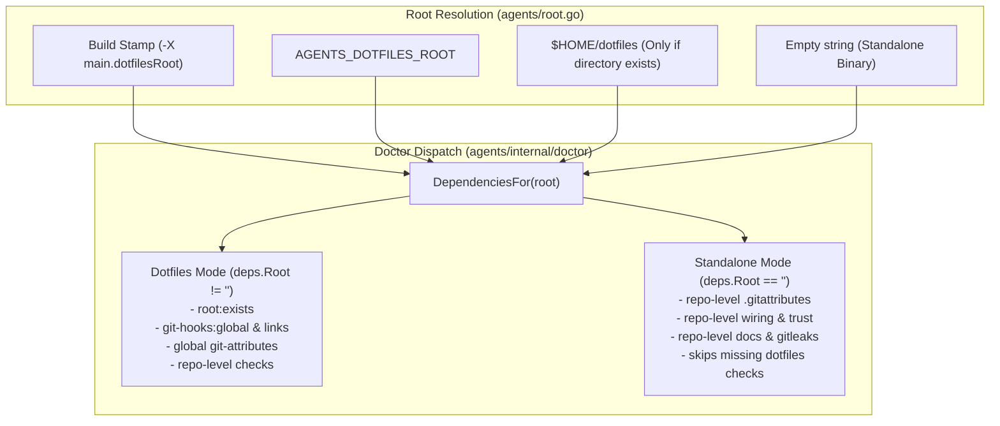

# Decouple `agents doctor` for Standalone Repositories Implementation Plan (Phase 2)

> **For agentic workers:** REQUIRED SUB-SKILL: Use superpowers:subagent-driven-development to implement this plan task-by-task. Steps use checkbox (`- [ ]`) syntax for tracking.

**Goal:** Decouple `agents doctor` so it operates cleanly in standalone repositories on contributor machines without requiring personal `dotfiles` checkouts, while preserving full dotfiles diagnostics when managing dotfiles checkouts.

**Architecture:** Refine `DotfilesRoot()` in `agents/root.go` to return an empty string when neither a build-time stamp nor `AGENTS_DOTFILES_ROOT` is present and `$HOME/dotfiles` does not exist. Update `doctor.DependenciesFor` and `RunWithDeps` in `agents/internal/doctor/doctor.go` so that when `deps.Root == ""` (Standalone Mode), dotfiles-specific checks (`root:exists`, `git-hooks:global`, `git-hooks:links`, and global `~/.gitattributes` link checks) are skipped, and repo-level `.gitattributes` and local hooks are validated directly.

**Architecture Diagram:**



**Tech Stack:** Go 1.24+, `os`, `path/filepath`, `strings`, `testing`

**Spec:** [`docs/design/2026-08-28-contributor-guardrails-and-scaffold-decoupling.md`](../design/2026-08-28-contributor-guardrails-and-scaffold-decoupling.md)

## Global Constraints

- Never break existing `agents doctor` behavior in the operator's `dotfiles` checkout.
- Maintain strict formatting: `gofmt -d .` must return 0 diffs.
- `go vet ./...` must return 0 warnings.
- All unit tests across all packages in `agents/...` must pass with zero failures.

---

### Task 1: Standalone Root Resolution in `agents/root.go` & `DependenciesFor`

**Files:**
- Modify: [`agents/root.go`](file:///Users/nilbot/dotfiles/agents/root.go)
- Modify: [`agents/root_test.go`](file:///Users/nilbot/dotfiles/agents/root_test.go)
- Modify: [`agents/internal/doctor/doctor.go`](file:///Users/nilbot/dotfiles/agents/internal/doctor/doctor.go)
- Modify: [`agents/internal/doctor/doctor_test.go`](file:///Users/nilbot/dotfiles/agents/internal/doctor/doctor_test.go)

**Interfaces:**
- `DotfilesRoot() string`: Returns build stamp if non-empty, else `AGENTS_DOTFILES_ROOT` if non-empty, else `$HOME/dotfiles` only if `$HOME/dotfiles` exists as a directory, else `""`.
- `doctor.DependenciesFor(root string) Dependencies`: When `root == ""`, leaves `Root`, `HooksDir`, `AttributesSource`, and `SharedGitConfig` empty.

- [ ] **Step 1: Write failing test in `root_test.go` and `doctor_test.go`**

Add tests in `agents/root_test.go`:
```go
func TestDotfilesRootReturnsEmptyWhenHomeDotfilesMissing(t *testing.T) {
	// Set HOME to a temp directory without ~/dotfiles
	tmpHome := t.TempDir()
	t.Setenv("HOME", tmpHome)
	t.Setenv("AGENTS_DOTFILES_ROOT", "")
	dotfilesRoot = "" // simulate unstamped release binary
	if got := DotfilesRoot(); got != "" {
		t.Errorf("DotfilesRoot() = %q, want empty string when ~/dotfiles does not exist", got)
	}
}
```

- [ ] **Step 2: Run test to verify it fails**

Run: `go test -v ./agents -run TestDotfilesRootReturnsEmptyWhenHomeDotfilesMissing`  
Expected: FAIL (currently falls back to `$HOME/dotfiles` regardless of existence).

- [ ] **Step 3: Implement minimal code in `root.go` and `doctor.go`**

In `agents/root.go`:
```go
func DotfilesRoot() string {
	if dotfilesRoot != "" {
		return dotfilesRoot
	}
	if fromEnv := os.Getenv("AGENTS_DOTFILES_ROOT"); fromEnv != "" {
		return fromEnv
	}
	home, err := os.UserHomeDir()
	if err != nil {
		return ""
	}
	fallback := filepath.Join(home, "dotfiles")
	if info, err := os.Stat(fallback); err == nil && info.IsDir() {
		return fallback
	}
	return ""
}
```

In `agents/internal/doctor/doctor.go`:
```go
func DependenciesFor(root string) Dependencies {
	home, _ := os.UserHomeDir()
	deps := Dependencies{
		LookPath:              exec.LookPath,
		Git:                   runGit,
		LegacyHooksPath:       repo.LegacyHooksPath,
		TraceCacheDir:         repo.TraceCacheDir,
		CodexConfig:           filepath.Join(home, ".codex", "config.toml"),
		AntigravityConfig:     filepath.Join(home, ".gemini", "antigravity-cli", "settings.json"),
		AttributesLink:        filepath.Join(home, ".gitattributes"),
		AttributesConfigValue: "~/.gitattributes",
		GlobalGitConfig:       filepath.Join(home, ".gitconfig"),
		Root:                  root,
	}
	if root != "" {
		deps.HooksDir = filepath.Join(root, "git", "hooks.d")
		deps.AttributesSource = filepath.Join(root, "git", "gitattributes")
		deps.SharedGitConfig = filepath.Join(root, "git", "gitconfig.shared")
	}
	return deps
}
```

- [ ] **Step 4: Run tests to verify they pass**

Run: `go test -v ./agents/...`  
Expected: PASS

- [ ] **Step 5: Commit**

```bash
git add agents/root.go agents/root_test.go agents/internal/doctor/doctor.go agents/internal/doctor/doctor_test.go
git commit -m "feat(doctor): support empty root resolution for standalone repositories"
```

---

### Task 2: Decouple Git Hooks and Git Attributes in Standalone Mode

**Files:**
- Modify: [`agents/internal/doctor/doctor.go`](file:///Users/nilbot/dotfiles/agents/internal/doctor/doctor.go)
- Modify: [`agents/internal/doctor/doctor_test.go`](file:///Users/nilbot/dotfiles/agents/internal/doctor/doctor_test.go)

**Interfaces:**
- `checkGitHooks(repoRoot, binary string, deps Dependencies) []Check`:
  - When `deps.Root == ""` (Standalone Mode), skips `git-hooks:global`, `git-hooks:links`, and `git-hooks:effective` comparison against dotfiles hooks. Validates repo-local hooks and effective hook overrides.
- `checkGitAttributes(repoRoot string, deps Dependencies) Check`:
  - When `deps.Root == ""` (Standalone Mode), skips global attributes link resolution and checks only that repo-level `.gitattributes` contains `.agents/** linguist-generated=true`.

- [ ] **Step 1: Write failing test in `doctor_test.go`**

Add test `TestDoctorStandaloneMode` verifying that `RunWithDeps` in a repo with `deps.Root == ""` passes without `root:exists`, `git-hooks:global`, or global `git-attributes` failures.

- [ ] **Step 2: Run test to verify it fails**

Run: `go test -v ./agents/internal/doctor -run TestDoctorStandaloneMode`  
Expected: FAIL

- [ ] **Step 3: Implement standalone checks in `doctor.go`**

Update `checkGitHooks` and `checkGitAttributes` in `agents/internal/doctor/doctor.go` to branch gracefully when `deps.Root == ""` or `deps.HooksDir == ""`.

- [ ] **Step 4: Run tests to verify they pass**

Run: `go test -v ./agents/internal/doctor/...` and `go test ./agents/...`  
Expected: PASS

- [ ] **Step 5: Commit**

```bash
git add agents/internal/doctor/doctor.go agents/internal/doctor/doctor_test.go
git commit -m "feat(doctor): decouple git hooks and attributes checks for standalone repositories"
```

---

### Task 3: Full Verification & Sandbox Validation

**Files:**
- Full test suite across `agents/...`

- [ ] **Step 1: Formatting and static analysis**
  - Run `gofmt -d .`
  - Run `go vet ./...`

- [ ] **Step 2: Full test suite**
  - Run `go test -count=1 ./...`

- [ ] **Step 3: Sandbox validation without dotfiles**
  - Create sandbox repo outside dotfiles with `AGENTS_DOTFILES_ROOT=""` and non-existent `HOME/dotfiles`.
  - Run `agents init` and `agents doctor`.
  - Verify all standalone checks report `ok` with 0 failures on missing dotfiles.
