# Standalone Binary Release Pipeline Implementation Plan (Phase 3)

> **For agentic workers:** REQUIRED SUB-SKILL: Use superpowers:subagent-driven-development to implement this plan task-by-task. Steps use checkbox (`- [ ]`) syntax for tracking.

**Goal:** Implement the complete standalone release and packaging pipeline for `agents` (Spec 6), including `agents version`, cross-platform release packaging for macOS and Linux, GitHub Actions release automation, and Homebrew formula.

**Architecture:** Add `agents version` (with `--version` and `-v` flag support) and linker metadata (`version`, `commit`, `date`) in `agents`. Implement `script/package-release.sh` to cross-compile for 4 target platforms (`darwin/arm64`, `darwin/amd64`, `linux/arm64`, `linux/amd64`), archive `.tar.gz` bundles, and generate `checksums.txt`. Create `.github/workflows/release.yml` for automated GitHub Releases on `v*` tags, and provide a Homebrew formula `Formula/agents.rb`.

**Architecture Diagram:**

```mermaid
graph TD
    subgraph VersionSurface["Version Surface (agents/)"]
        Vars["main.version, main.commit, main.date\n(Linker stamped)"]
        CmdVersion["agents version / --version\n(Formatted provenance string)"]
        Vars --> CmdVersion
    end

    subgraph Packaging["Packaging Pipeline (script/package-release.sh)"]
        CrossBuild["Go Cross-Compile\n- darwin/arm64, darwin/amd64\n- linux/arm64, linux/amd64"]
        TarGz["Archive Bundles\nagents_vX.Y.Z_os_arch.tar.gz"]
        Checksums["checksums.txt\n(SHA-256 manifest)"]
        CrossBuild --> TarGz --> Checksums
    end

    subgraph Publishing["Publishing (.github/workflows/release.yml & Homebrew)"]
        TagPush["Git Tag Push (v*)"]
        GHRelease["GitHub Actions Release\n(Uploads tarballs + checksums)"]
        BrewFormula["Formula/agents.rb\n(Homebrew Tap Formula)"]
        TagPush --> GHRelease --> BrewFormula
    end
```



**Tech Stack:** Go 1.24+, `bash`, `tar`, `sha256sum`, GitHub Actions, Homebrew Ruby DSL

**Spec:** [`docs/design/2026-08-11-spec-6-releases-and-distribution.md`](../design/2026-08-11-spec-6-releases-and-distribution.md)

## Global Constraints

- Released binaries must never stamp personal dotfiles paths (`dotfilesRoot` remains empty `""`).
- Build reproducibility: cross-compilations must use `-trimpath` and clean `-ldflags "-s -w ..."`.
- Code formatting: `gofmt -d .` must return 0 diffs.
- `go vet ./...` must return 0 warnings.
- All unit tests across all packages must pass cleanly.

---

### Task 1: Add `version` Command and Flags to `agents` CLI

**Files:**
- Create: [`agents/cmd_version.go`](file:///Users/nilbot/dotfiles/agents/cmd_version.go)
- Create: [`agents/cmd_version_test.go`](file:///Users/nilbot/dotfiles/agents/cmd_version_test.go)
- Modify: [`agents/commands.go`](file:///Users/nilbot/dotfiles/agents/commands.go)
- Modify: [`agents/main.go`](file:///Users/nilbot/dotfiles/agents/main.go)
- Modify: [`agents/main_test.go`](file:///Users/nilbot/dotfiles/agents/main_test.go)

**Interfaces:**
- `var version = "dev"`, `var commit = "none"`, `var date = "unknown"` in `main.go`.
- `runVersion(args []string, stdout io.Writer) int`: Outputs `agents <version> (commit: <commit>, built: <date>)`.
- Top-level `--version` and `-v` flags in `run(args []string)` dispatch to `runVersion`.
- `commands.go` declares `"version"` command with `Summary: "print binary version and build provenance"`.

- [ ] **Step 1: Write failing test in `cmd_version_test.go` and `main_test.go`**

Add tests asserting:
- `agents version` prints version format `agents <version> (commit: <commit>, built: <date>)`.
- `agents --version` and `agents -v` invoke version output and exit `0`.

- [ ] **Step 2: Run test to verify it fails**

Run: `go test -v ./agents -run TestVersion`  
Expected: FAIL

- [ ] **Step 3: Implement `cmd_version.go`, `commands.go`, `main.go`**

- [ ] **Step 4: Run tests to verify they pass**

Run: `go test -v ./agents/...`  
Expected: PASS

- [ ] **Step 5: Commit**

```bash
git add agents/cmd_version.go agents/cmd_version_test.go agents/commands.go agents/main.go agents/main_test.go
git commit -m "feat(cli): add version command and build provenance flags"
```

---

### Task 2: Release Packaging Script & Makefile Target

**Files:**
- Create: `script/package-release.sh`
- Modify: `Makefile`

**Interfaces:**
- `script/package-release.sh <version> <out-dir>`:
  - Builds 4 targets: `darwin/arm64`, `darwin/amd64`, `linux/arm64`, `linux/amd64`.
  - Packages `agents_${VERSION}_${GOOS}_${GOARCH}.tar.gz` containing `agents` and `README.md`.
  - Generates `checksums.txt` containing SHA-256 sums.
- `Makefile`: adds `release` target invoking `script/package-release.sh`.

- [ ] **Step 1: Write `script/package-release.sh`**

- [ ] **Step 2: Make executable and test packaging locally in `/tmp/test-release`**

- [ ] **Step 3: Add `release` target to `Makefile`**

- [ ] **Step 4: Verify generated tarballs and checksums**

- [ ] **Step 5: Commit**

```bash
git add script/package-release.sh Makefile
git commit -m "feat(release): add cross-platform packaging script and release target"
```

---

### Task 3: GitHub Actions Release Workflow and Homebrew Formula

**Files:**
- Create: `.github/workflows/release.yml`
- Create: `Formula/agents.rb`

**Interfaces:**
- `.github/workflows/release.yml`:
  - Triggers on `push` of tags `v*`.
  - Runs verify checks, runs `script/package-release.sh`, and publishes GitHub Release.
- `Formula/agents.rb`:
  - Homebrew formula pointing to GitHub release URL and sha256.

- [ ] **Step 1: Write `.github/workflows/release.yml` following pinned action SHA rules**

- [ ] **Step 2: Write `Formula/agents.rb`**

- [ ] **Step 3: Validate syntax and workflow YAML structure**

- [ ] **Step 4: Commit**

```bash
git add .github/workflows/release.yml Formula/agents.rb
git commit -m "feat(release): add GitHub Actions release workflow and Homebrew formula"
```

---

### Task 4: Full Subsystem Verification & Whole-Branch Review

- [ ] **Step 1: Formatting and static analysis (`gofmt -d .`, `go vet ./...`)**
- [ ] **Step 2: Full test suite execution across all modules (`go test -count=1 ./...`)**
- [ ] **Step 3: Live verification of version stamping and packaging**
