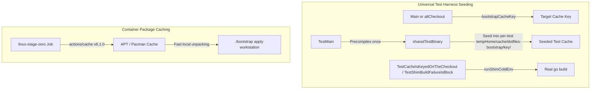

# CI Latency and Test Harness Optimization (Phase 2) Implementation Plan

> **For agentic workers:** REQUIRED SUB-SKILL: Use superpowers:subagent-driven-development to implement this plan task-by-task. Steps use checkbox (`- [ ]`) syntax for tracking.

**Goal:** Further reduce GitHub Actions CI suite wall-clock latency from ~3m23s down to ~1m15s by eliminating alt-checkout test compilation churn and caching stage-zero Linux container package downloads.

**Architecture:** Extend test harness pre-compilation cache seeding in `bootstrap.d/main_test.go` to dynamically compute POSIX `cksum` cache keys for any checkout directory (`altCheckout`), eliminating 7–8 redundant `go build` runs during manifest and config tests. In `.github/workflows/verify.yml`, add pinned `actions/cache` steps for package manager download archives in `linux-stage-zero`.

**Architecture Diagram:**



**Tech Stack:** Go 1.26+, Bash, GitHub Actions YAML, `actions/cache@v6.1.0`

**Spec:** [docs/design/2026-08-29-ci-latency-and-test-harness-optimization-phase-2.md](file:///Users/nilbot/dotfiles/docs/design/2026-08-29-ci-latency-and-test-harness-optimization-phase-2.md)

## Global Constraints

- Pinned action format: exact commit SHA with trailing `# v6.1.0` comment.
- Production `./bootstrap` script remains untouched.
- Full test hermeticity and coverage maintained across all OS platforms.

---

### Task 1: Universal Test Cache Seeding in `bootstrap.d/main_test.go`

**Files:**
- Modify: `bootstrap.d/main_test.go:90-130`, `bootstrap.d/main_test.go:1060-1090`

**Interfaces:**
- Produces: `bootstrapCacheKey(t *testing.T, root string) string`
- Consumes: Standard Go `testing`, `os/exec`, `os`

- [ ] **Step 1: Implement `bootstrapCacheKey` and update `runShimIn`**

In `bootstrap.d/main_test.go`:
```go
func bootstrapCacheKey(t *testing.T, root string) string {
	t.Helper()
	cmd := exec.Command("sh", "-c", "printf '%s' \"$1\" | cksum | tr -cd '0-9'", "_", root)
	out, err := cmd.Output()
	if err != nil {
		t.Fatalf("bootstrapCacheKey %q: %v", root, err)
	}
	return string(out)
}
```

Update `runShimIn` to derive and seed for any checkout when `cold == false`:
```go
func runShimIn(t *testing.T, dir, shim, home string, extraEnv []string, cold bool, args ...string) (string, string, int) {
	t.Helper()
	if !cold && sharedTestBinary != "" {
		shimDir := filepath.Dir(shim)
		if !filepath.IsAbs(shimDir) {
			shimDir = filepath.Join(dir, shimDir)
		}
		absRoot, err := filepath.Abs(shimDir)
		if err == nil {
			key := bootstrapCacheKey(t, absRoot)
			destDir := filepath.Join(home, "cache", "dotfiles-bootstrap", key)
			destBin := filepath.Join(destDir, "bootstrap")
			if _, err := os.Stat(destBin); os.IsNotExist(err) {
				if err := os.MkdirAll(destDir, 0o755); err != nil {
					t.Fatal(err)
				}
				data, err := os.ReadFile(sharedTestBinary)
				if err != nil {
					t.Fatal(err)
				}
				if err := os.WriteFile(destBin, data, 0o755); err != nil {
					t.Fatal(err)
				}
				now := time.Now()
				_ = os.Chtimes(destBin, now, now)
			}
		}
	}
	cmd := exec.Command(shim, args...)
	cmd.Dir = dir
	cmd.Env = append(os.Environ(), "HOME="+home, "XDG_CACHE_HOME="+home+"/cache")
	cmd.Env = append(cmd.Env,
		"PATH="+stubToolDir(t)+string(os.PathListSeparator)+os.Getenv("PATH"))
	cmd.Env = append(cmd.Env, extraEnv...)
	var stdout, stderr strings.Builder
	cmd.Stdout = &stdout
	cmd.Stderr = &stderr
	err := cmd.Run()
	code := 0
	if exit, ok := err.(*exec.ExitError); ok {
		code = exit.ExitCode()
	} else if err != nil {
		t.Fatal(err)
	}
	return stdout.String(), stderr.String(), code
}
```

- [ ] **Step 2: Update `TestCacheIsKeyedOnTheCheckout` to use `runShimColdEnv` for second checkout**

In `bootstrap.d/main_test.go`:
```go
func TestCacheIsKeyedOnTheCheckout(t *testing.T) {
	home := tempHome(t)
	if _, stderr, code := runShim(t, home, "--help"); code != 0 {
		t.Fatalf("first checkout exit %d: %s", code, stderr)
	}

	const marker = "ALTERNATE-CHECKOUT-MARKER"
	alt := altCheckout(t)
	main := filepath.Join(alt, "bootstrap.d", "main.go")
	source, err := os.ReadFile(main)
	if err != nil {
		t.Fatal(err)
	}
	patched := strings.Replace(string(source), "usage: bootstrap <verb>", marker+" <verb>", 1)
	if patched == string(source) {
		t.Fatal("could not patch the second checkout's usage text; the marker would prove nothing")
	}
	if err := os.WriteFile(main, []byte(patched), 0o644); err != nil {
		t.Fatal(err)
	}
	backdate(t, filepath.Join(alt, "bootstrap.d"))

	stdout, stderr, code := runShimColdEnv(t, filepath.Join(alt, "bootstrap"), home, nil, "--help")
	if code != 0 {
		t.Fatalf("second checkout exit %d: %s", code, stderr)
	}
	if !strings.Contains(stdout, marker) {
		t.Errorf("the second checkout ran the first one's binary -- old code against a new tree:\n%s", stdout)
	}
}
```

- [ ] **Step 3: Verify local test execution**

Run: `cd bootstrap.d && go test -v -count=1 ./...`
Expected: ALL tests pass, execution duration < 5s.

- [ ] **Step 4: Commit changes**

```bash
git add bootstrap.d/main_test.go
git commit -m "perf(bootstrap): extend test harness cache seeding to alt-checkouts"
```

---

### Task 2: Package Cache in `linux-stage-zero` (`.github/workflows/verify.yml`)

**Files:**
- Modify: `.github/workflows/verify.yml:291-325`

- [ ] **Step 1: Add `pkg_cache` to matrix and `actions/cache` step in `linux-stage-zero`**

In `.github/workflows/verify.yml`:
```yaml
  linux-stage-zero:
    runs-on: ubuntu-latest
    timeout-minutes: 45
    strategy:
      fail-fast: false
      matrix:
        include:
          - image: debian:stable-slim
            pkg_cache: /var/cache/apt/archives
            prereqs: apt-get update -qq && apt-get install -y -qq sudo golang-go git ca-certificates curl
          - image: archlinux:base
            pkg_cache: /var/cache/pacman/pkg
            prereqs: sed -i '/^\[options\]/a DisableSandbox' /etc/pacman.conf && pacman -Syu --needed --noconfirm sudo go git curl
    container:
      image: ${{ matrix.image }}
      options: --user root
    steps:
      - name: cache package archives
        uses: actions/cache@55cc8345863c7cc4c66a329aec7e433d2d1c52a9 # v6.1.0
        with:
          path: ${{ matrix.pkg_cache }}
          key: stage-zero-${{ matrix.image }}-${{ github.run_id }}
          restore-keys: |
            stage-zero-${{ matrix.image }}-
      - name: prerequisites and passwordless sudo
        run: |
          set -eux
          ${{ matrix.prereqs }}
          echo "root ALL=(ALL) NOPASSWD: ALL" > /etc/sudoers.d/ci
          chmod 0440 /etc/sudoers.d/ci
```

- [ ] **Step 2: Commit workflow changes**

```bash
git add .github/workflows/verify.yml
git commit -m "ci(verify): cache package manager archives in linux-stage-zero container jobs"
```

---

### Task 3: Full Verification

**Files:**
- Verification only

- [ ] **Step 1: Run all test suites**
Run: `(cd agents && go test -v -count=1 ./...) && (cd bootstrap.d && go test -v -count=1 ./...)`
Expected: PASS

- [ ] **Step 2: Run containment and umask checks**
Run:
```bash
GOMODCACHE_REAL=$(go env GOMODCACHE)
GOPATH_REAL=$(go env GOPATH)
H=$(mktemp -d); X=$(mktemp -d)
for module in agents bootstrap.d; do
  ( cd "$module" && HOME="$H" XDG_CACHE_HOME="$X" XDG_CONFIG_HOME="$X/config" \
      GOMODCACHE="$GOMODCACHE_REAL" GOPATH="$GOPATH_REAL" \
      go test -count=1 ./... )
done
[ -d "$H" ]
[ -z "$(find "$H" -mindepth 1 -print -quit)" ]
( umask 077 && cd bootstrap.d && go test -count=1 ./... )
```
Expected: PASS
