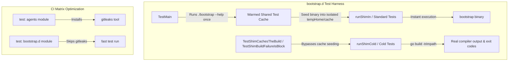

# CI Latency and Test Harness Optimization Implementation Plan

> **For agentic workers:** REQUIRED SUB-SKILL: Use superpowers:subagent-driven-development to implement this plan task-by-task. Steps use checkbox (`- [ ]`) syntax for tracking.

**Goal:** Reduce GitHub Actions CI wall-clock execution time by ~60% (from 6.2m down to ~2.4m) by eliminating redundant Go binary compilation in the `bootstrap.d` test harness and scoping workflow matrix steps.

**Architecture:** A one-time pre-compilation step in `bootstrap.d/main_test.go` (`TestMain`) warms a shared test cache, allowing standard integration tests to seed their per-test `t.TempDir()` cache without shelling out to `go build` 45+ times sequentially. Dedicated cold-build tests (`TestShimCachesTheBuild`, `TestShimBuildFailureIsBlock`) use `runShimCold` to preserve cold compilation coverage. In CI, `gitleaks` installation is scoped exclusively to the `agents` matrix module.

**Architecture Diagram:**



**Tech Stack:** Go 1.26+, Bash, GitHub Actions YAML

**Spec:** [docs/design/2026-08-29-ci-latency-and-test-harness-optimization.md](file:///Users/nilbot/dotfiles/docs/design/2026-08-29-ci-latency-and-test-harness-optimization.md)

## Global Constraints

- Go 1.26+ toolchain standards.
- Production `./bootstrap` script remains completely unchanged (no test-specific flags or bypasses).
- 100% test isolation and hermeticity preserved across `tempHome(t)` environments.
- Zero test coverage regression; all CLI, race, containment, and cold-build checks must pass.

---

### Task 1: Pre-compilation and Cache Seeding in `bootstrap.d/main_test.go`

**Files:**
- Modify: `bootstrap.d/main_test.go:1-120`, `bootstrap.d/main_test.go:960-1090`

**Interfaces:**
- Produces: `TestMain(m *testing.M)`, `runShimCold(t *testing.T, home string, args ...string)`, `runShimColdEnv(t *testing.T, shim, home string, extraEnv []string, args ...string)`
- Consumes: Standard Go `testing`, `os/exec`, `os`

- [ ] **Step 1: Add package variables and `TestMain` lifecycle in `bootstrap.d/main_test.go`**

```go
var (
	sharedTestKey    string
	sharedTestBinary string
)

func TestMain(m *testing.M) {
	sharedDir, err := os.MkdirTemp("", "bootstrap-test-shared-*")
	if err != nil {
		fmt.Fprintf(os.Stderr, "TestMain: %v\n", err)
		os.Exit(1)
	}
	defer os.RemoveAll(sharedDir)

	root, err := filepath.Abs("..")
	if err != nil {
		fmt.Fprintf(os.Stderr, "TestMain: %v\n", err)
		os.Exit(1)
	}

	// Warm the cache by running the real shim once into the shared test cache
	cmd := exec.Command(filepath.Join(root, "bootstrap"), "--help")
	cmd.Env = append(os.Environ(), "HOME="+sharedDir, "XDG_CACHE_HOME="+sharedDir+"/cache")
	if out, err := cmd.CombinedOutput(); err != nil {
		fmt.Fprintf(os.Stderr, "TestMain build failed: %v: %s\n", err, out)
		os.Exit(1)
	}

	cacheRoot := filepath.Join(sharedDir, "cache", "dotfiles-bootstrap")
	entries, err := os.ReadDir(cacheRoot)
	if err != nil || len(entries) == 0 {
		fmt.Fprintf(os.Stderr, "TestMain: could not find warmed cache in %s: %v\n", cacheRoot, err)
		os.Exit(1)
	}
	sharedTestKey = entries[0].Name()
	sharedTestBinary = filepath.Join(cacheRoot, sharedTestKey, "bootstrap")

	code := m.Run()
	os.Exit(code)
}
```

- [ ] **Step 2: Update `runShimIn`, `runShimEnv`, `runShimCold`, `runShimColdEnv`**

```go
// runShim invokes the real ./bootstrap from an unrelated working directory.
func runShim(t *testing.T, home string, args ...string) (string, string, int) {
	t.Helper()
	return runShimEnv(t, filepath.Join(repoRoot(t), "bootstrap"), home, nil, args...)
}

// runShimCold is runShim without test cache seeding, forcing ./bootstrap to build.
func runShimCold(t *testing.T, home string, args ...string) (string, string, int) {
	t.Helper()
	return runShimColdEnv(t, filepath.Join(repoRoot(t), "bootstrap"), home, nil, args...)
}

func runShimEnv(t *testing.T, shim, home string, extraEnv []string, args ...string) (string, string, int) {
	t.Helper()
	return runShimIn(t, t.TempDir(), shim, home, extraEnv, false, args...)
}

func runShimColdEnv(t *testing.T, shim, home string, extraEnv []string, args ...string) (string, string, int) {
	t.Helper()
	return runShimIn(t, t.TempDir(), shim, home, extraEnv, true, args...)
}

func runShimIn(t *testing.T, dir, shim, home string, extraEnv []string, cold bool, args ...string) (string, string, int) {
	t.Helper()
	if !cold && sharedTestBinary != "" && shim == filepath.Join(repoRoot(t), "bootstrap") {
		destDir := filepath.Join(home, "cache", "dotfiles-bootstrap", sharedTestKey)
		destBin := filepath.Join(destDir, "bootstrap")
		if _, err := os.Stat(destBin); os.IsNotExist(err) {
			if err := os.MkdirAll(destDir, 0o755); err != nil {
				t.Fatal(err)
			}
			data, err := os.ReadFile(sharedTestBinary)
			if err != nil {
				t.Fatal(err)
			}
			if err := os.WriteFile(destBin, data, 0o755); err != nil {
				t.Fatal(err)
			}
		}
	}
	cmd := exec.Command(shim, args...)
	cmd.Dir = dir
	cmd.Env = append(os.Environ(), "HOME="+home, "XDG_CACHE_HOME="+home+"/cache")
	cmd.Env = append(cmd.Env,
		"PATH="+stubToolDir(t)+string(os.PathListSeparator)+os.Getenv("PATH"))
	cmd.Env = append(cmd.Env, extraEnv...)
	var stdout, stderr strings.Builder
	cmd.Stdout = &stdout
	cmd.Stderr = &stderr
	err := cmd.Run()
	code := 0
	if exit, ok := err.(*exec.ExitError); ok {
		code = exit.ExitCode()
	} else if err != nil {
		t.Fatal(err)
	}
	return stdout.String(), stderr.String(), code
}
```

- [ ] **Step 3: Update `TestShimCachesTheBuild` and `TestShimBuildFailureIsBlock` to use cold helpers**

```go
func TestShimCachesTheBuild(t *testing.T) {
	home := tempHome(t)
	_, first, code := runShimCold(t, home, "--help")
	if code != 0 {
		t.Fatalf("first run exit %d: %s", code, first)
	}
	if !strings.Contains(first, "building") {
		t.Fatalf("first run into a fresh cache did not build; the case is not exercising the cache: %s", first)
	}
	_, stderr, code := runShim(t, home, "--help")
	if code != 0 {
		t.Fatalf("second run exit %d: %s", code, stderr)
	}
	if strings.Contains(stderr, "building") {
		t.Errorf("second run rebuilt; the cache is not working: %s", stderr)
	}
}

func TestShimBuildFailureIsBlock(t *testing.T) {
	alt := altCheckout(t)
	main := filepath.Join(alt, "bootstrap.d", "main.go")
	if err := os.WriteFile(main, []byte("this is not go\n"), 0o644); err != nil {
		t.Fatal(err)
	}

	_, stderr, code := runShimColdEnv(t, filepath.Join(alt, "bootstrap"), tempHome(t), nil, "--help")
	if code != 2 {
		t.Fatalf("exit %d, want 2 (block): %s", code, stderr)
	}
	if !strings.Contains(stderr, "the build failed") {
		t.Errorf("stderr did not identify the build failure: %s", stderr)
	}
}
```

- [ ] **Step 4: Verify `bootstrap.d` test execution time and test passes**

Run: `cd bootstrap.d && go test -v -count=1 ./...`
Expected: ALL tests pass, execution duration drops from ~150s to < 10s.

Run: `cd bootstrap.d && go test -v -count=1 -race ./...`
Expected: ALL tests pass under race detector, duration < 15s.

- [ ] **Step 5: Commit changes**

```bash
git add bootstrap.d/main_test.go
git commit -m "perf(bootstrap): seed precompiled test binary in harness to eliminate rebuild churn"
```

---

### Task 2: Conditional `gitleaks` Installation in `.github/workflows/verify.yml`

**Files:**
- Modify: `.github/workflows/verify.yml:65-70`

- [ ] **Step 1: Add `if: matrix.module == 'agents'` condition**

In `.github/workflows/verify.yml`:
```diff
       - name: install gitleaks, checksum-verified
+        if: matrix.module == 'agents'
         env:
           GITLEAKS_VERSION: '8.30.1'
```

- [ ] **Step 2: Commit workflow changes**

```bash
git add .github/workflows/verify.yml
git commit -m "ci(verify): skip gitleaks installation for bootstrap.d matrix legs"
```

---

### Task 3: Full Repository Test & Hygiene Verification

**Files:**
- Verification only

- [ ] **Step 1: Run agents test suite**

Run: `cd /Users/nilbot/dotfiles/agents && go test -v -count=1 ./...`
Expected: PASS

- [ ] **Step 2: Run bootstrap.d test suite**

Run: `cd /Users/nilbot/dotfiles/bootstrap.d && go test -v -count=1 ./...`
Expected: PASS in < 10s

- [ ] **Step 3: Run hygiene containment and umask assertions**

Run:
```bash
GOMODCACHE_REAL=$(go env GOMODCACHE)
GOPATH_REAL=$(go env GOPATH)
H=$(mktemp -d); X=$(mktemp -d)
for module in agents bootstrap.d; do
  ( cd "$module" && HOME="$H" XDG_CACHE_HOME="$X" XDG_CONFIG_HOME="$X/config" \
      GOMODCACHE="$GOMODCACHE_REAL" GOPATH="$GOPATH_REAL" \
      go test -count=1 ./... )
done
[ -d "$H" ]
[ -z "$(find "$H" -mindepth 1 -print -quit)" ]
( umask 077 && cd bootstrap.d && go test -count=1 ./... )
```
Expected: PASS, synthetic `$HOME` remains empty, restrictive umask passes.

- [ ] **Step 4: Run `agents doctor` (if installed)**

Run: `agents doctor`
Expected: Clean doctor output with 0 warnings.
