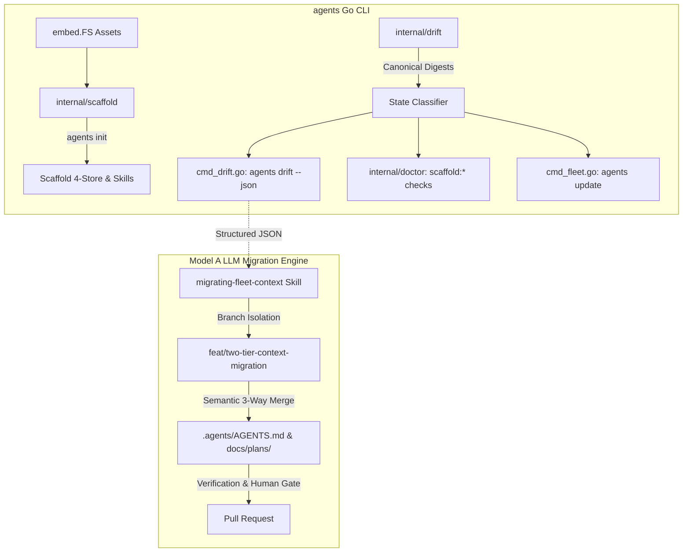

# Two-Tier Agent Context & Model A Migration Implementation Plan

> **For agentic workers:** REQUIRED SUB-SKILL: Use superpowers:subagent-driven-development to implement this plan task-by-task. Steps use checkbox (`- [ ]`) syntax for tracking.

**Goal:** Implement the deterministic CLI capabilities (`embed.FS` asset scaffolding, `internal/drift` inspection, `agents drift` command, enhanced `doctor` diagnostics, refined `agents update` wiring) and the authoritative Model A `migrating-fleet-context` agent skill.

**Architecture:** Embed canonical starter assets directly in the `agents` Go binary via `embed.FS`. Build a standalone `internal/drift` package to classify router and skill states deterministically. Expose `agents drift [--json]` and 5 granular `scaffold:*` doctor checks. Refine `agents update` to synchronize machine wiring and refresh authoritative infrastructural skills. Author the authoritative `migrating-fleet-context` skill for semantic un-nesting and doc relocation.

**Architecture Diagram:**



**Tech Stack:** Go 1.26+ (`embed.FS`, standard library `flag`, `os`, `path/filepath`, `crypto/sha256`), Git, Fish shell, Markdown.

**Spec:** [docs/design/2026-08-29-two-tier-context-and-llm-migration-architecture.md](file:///Users/nilbot/dotfiles/docs/design/2026-08-29-two-tier-context-and-llm-migration-architecture.md)

## Global Constraints

- Go 1.26+ standard tooling (`go test -v ./agents/...`, `go vet ./agents/...`).
- Strict non-mutation and idempotency across all CLI operations.
- CLI Interface Documentation Invariant: any CLI command/flag added or modified must update `agents/README.md`, root `README.md`, CLI built-in help, and applicable docs.
- Branch protection & PR policy: changes must be developed on feature branches and verified before merge.
- Specs live in `docs/design/`, plans live in `docs/plans/`.

---

### Task 1: Asset Embedding & Full Scaffolding in `agents/internal/scaffold`

**Files:**
- Create: `agents/internal/scaffold/assets/skills/recording-what-you-learn/SKILL.md`
- Create: `agents/internal/scaffold/assets/skills/migrating-fleet-context/SKILL.md`
- Create: `agents/internal/scaffold/assets/dotagents/AGENTS.md`
- Create: `agents/internal/scaffold/assets/docs/design/README.md`
- Create: `agents/internal/scaffold/assets/docs/plans/README.md`
- Create: `agents/internal/scaffold/assets/docs/journal/README.md`
- Create: `agents/internal/scaffold/assets/docs/qna/README.md`
- Create: `agents/internal/scaffold/assets.go`
- Modify: `agents/internal/scaffold/scaffold.go:80-150`
- Test: `agents/internal/scaffold/scaffold_test.go`

**Interfaces:**
- Consumes: Go standard library `embed.FS`.
- Produces: `scaffold.Create(root string, local bool) error` scaffolding full Two-Tier + 4-store hierarchy and embedded assets.

- [ ] **Step 1: Write failing test for embedded scaffolding**

In `agents/internal/scaffold/scaffold_test.go`:
```go
func TestCreateScaffoldsFullTwoTierAndDocsHierarchy(t *testing.T) {
	dir := t.TempDir()
	if err := Create(dir, false); err != nil {
		t.Fatalf("Create failed: %v", err)
	}

	wantFiles := []string{
		"AGENTS.md",
		"CLAUDE.md",
		".gitattributes",
		".agents/AGENTS.md",
		".agents/skills/recording-what-you-learn/SKILL.md",
		".agents/skills/migrating-fleet-context/SKILL.md",
		"docs/design/README.md",
		"docs/plans/README.md",
		"docs/journal/README.md",
		"docs/qna/README.md",
	}
	for _, rel := range wantFiles {
		p := filepath.Join(dir, rel)
		if _, err := os.Stat(p); err != nil {
			t.Errorf("expected file %s to exist: %v", rel, err)
		}
	}
}
```

- [ ] **Step 2: Run test to verify it fails**

Run: `go test -v ./agents/internal/scaffold -run TestCreateScaffoldsFullTwoTierAndDocsHierarchy`  
Expected: FAIL (missing embedded assets and docs directories).

- [ ] **Step 3: Create assets and implement `embed.FS` scaffolding**

Create `agents/internal/scaffold/assets.go`:
```go
package scaffold

import "embed"

//go:embed assets/*
var AssetsFS embed.FS
```

Populate `assets/` files with canonical starter templates:
- `assets/skills/recording-what-you-learn/SKILL.md` (copied from `.agents/skills/recording-what-you-learn/SKILL.md`)
- `assets/skills/migrating-fleet-context/SKILL.md` (authoritative migration skill)
- `assets/dotagents/AGENTS.md` (starter domain rules)
- `assets/docs/{design,plans,journal,qna}/README.md` (index READMEs)

Update `scaffold.Create` in `scaffold.go` to create `docs/{design,plans,journal,qna}` and populate embedded assets via `writeIfAbsentFromFS`.

- [ ] **Step 4: Run test to verify it passes**

Run: `go test -v ./agents/internal/scaffold`  
Expected: PASS.

- [ ] **Step 5: Commit**

```bash
git add agents/internal/scaffold/
git commit -m "feat(scaffold): embed canonical assets and scaffold 4-store docs layout"
```

---

### Task 2: Deterministic Drift Inspection Subsystem in `agents/internal/drift`

**Files:**
- Create: `agents/internal/drift/drift.go`
- Create: `agents/internal/drift/digests.go`
- Test: `agents/internal/drift/drift_test.go`

**Interfaces:**
- Consumes: `agents/internal/scaffold`, `os`, `crypto/sha256`.
- Produces:
  ```go
  type RouterState string
  type ComponentState string
  type DriftReport struct { ... }
  func InspectRepo(root string) (DriftReport, error)
  ```

- [ ] **Step 1: Write failing unit tests for drift inspection**

In `agents/internal/drift/drift_test.go`:
```go
func TestInspectCleanCurrentRepo(t *testing.T) {
	dir := t.TempDir()
	if err := scaffold.Create(dir, false); err != nil {
		t.Fatal(err)
	}
	report, err := InspectRepo(dir)
	if err != nil {
		t.Fatalf("InspectRepo failed: %v", err)
	}
	if report.RouterState != "clean_current" {
		t.Errorf("got router state %q, want clean_current", report.RouterState)
	}
	if report.SymlinkState != "ok" {
		t.Errorf("got symlink state %q, want ok", report.SymlinkState)
	}
	if report.DomainState != "ok" {
		t.Errorf("got domain state %q, want ok", report.DomainState)
	}
}

func TestInspectDriftedRepo(t *testing.T) {
	dir := t.TempDir()
	if err := scaffold.Create(dir, false); err != nil {
		t.Fatal(err)
	}
	// Append custom rule to root AGENTS.md
	agentsPath := filepath.Join(dir, "AGENTS.md")
	f, _ := os.OpenFile(agentsPath, os.O_APPEND|os.O_WRONLY, 0o644)
	f.WriteString("\n## Custom Domain Rules\n- Use Python uv\n")
	f.Close()

	report, err := InspectRepo(dir)
	if err != nil {
		t.Fatalf("InspectRepo failed: %v", err)
	}
	if report.RouterState != "drifted" {
		t.Errorf("got router state %q, want drifted", report.RouterState)
	}
	if report.Diff == "" {
		t.Error("expected non-empty diff for drifted repo")
	}
}
```

- [ ] **Step 2: Run test to verify it fails**

Run: `go test -v ./agents/internal/drift`  
Expected: FAIL (package does not exist).

- [ ] **Step 3: Implement `drift.go` and `digests.go`**

Implement:
- `CanonicalRouterDigests`: SHA256 hashes of `scaffold.DefaultAgentsMD` and legacy canonical templates.
- `InspectRepo(root string) (DriftReport, error)`:
  - Validates `AGENTS.md` content against digest catalog.
  - Generates unified diff when drifted.
  - Checks relative symlink `CLAUDE.md -> AGENTS.md`.
  - Checks `.agents/AGENTS.md` and `.agents/skills/`.
  - Checks `docs/` stores and flags misplaced `*-plan.md` in `docs/journal/`.

- [ ] **Step 4: Run test to verify it passes**

Run: `go test -v ./agents/internal/drift`  
Expected: PASS.

- [ ] **Step 5: Commit**

```bash
git add agents/internal/drift/
git commit -m "feat(drift): implement deterministic repo drift inspection and digest catalog"
```

---

### Task 3: Dedicated `agents drift` Subcommand

**Files:**
- Create: `agents/cmd_drift.go`
- Modify: `agents/commands.go:20-50`
- Modify: `agents/commands_test.go`
- Test: `agents/cmd_drift_test.go`

**Interfaces:**
- Consumes: `agents/internal/drift`, `agents/internal/registry`, `agents/internal/exitcode`.
- Produces: CLI subcommand `agents drift [--json] [--repo <path>] [--all]`.

- [ ] **Step 1: Write failing CLI tests for `agents drift`**

In `agents/cmd_drift_test.go`:
```go
func TestCmdDriftCleanRepo(t *testing.T) {
	dir := t.TempDir()
	if err := scaffold.Create(dir, false); err != nil {
		t.Fatal(err)
	}
	var out bytes.Buffer
	code := runDrift([]string{"--repo", dir}, &out)
	if code != exitcode.OK {
		t.Fatalf("runDrift exit=%d want=0\n%s", code, out.String())
	}
	if !strings.Contains(out.String(), "clean_current") {
		t.Errorf("output missing clean_current: %s", out.String())
	}
}

func TestCmdDriftJSONOutput(t *testing.T) {
	dir := t.TempDir()
	if err := scaffold.Create(dir, false); err != nil {
		t.Fatal(err)
	}
	var out bytes.Buffer
	code := runDrift([]string{"--repo", dir, "--json"}, &out)
	if code != exitcode.OK {
		t.Fatalf("runDrift exit=%d want=0\n%s", code, out.String())
	}
	var r drift.DriftReport
	if err := json.Unmarshal(out.Bytes(), &r); err != nil {
		t.Fatalf("failed to parse JSON output: %v\n%s", err, out.Bytes())
	}
}
```

- [ ] **Step 2: Run test to verify it fails**

Run: `go test -v ./agents -run TestCmdDrift`  
Expected: FAIL (`runDrift` not defined).

- [ ] **Step 3: Implement `cmd_drift.go` and register command**

In `agents/cmd_drift.go`:
- Parse `--json`, `--repo`, `--all`.
- Execute `drift.InspectRepo`.
- Format human-readable colored summary or emit raw JSON.
- In `agents/commands.go`, register `"drift": runDrift`.

- [ ] **Step 4: Run test to verify it passes**

Run: `go test -v ./agents -run TestCmdDrift`  
Expected: PASS.

- [ ] **Step 5: Commit**

```bash
git add agents/cmd_drift.go agents/cmd_drift_test.go agents/commands.go agents/commands_test.go
git commit -m "feat(cli): add agents drift subcommand with json and fleet inspection"
```

---

### Task 4: Granular `agents doctor` Diagnostics

**Files:**
- Modify: `agents/internal/doctor/doctor.go:200-205, 1000-1030`
- Modify: `agents/internal/doctor/doctor_test.go`
- Modify: `agents/cmd_doctor_test.go`

**Interfaces:**
- Consumes: `agents/internal/drift`.
- Produces: Granular checks: `scaffold:router`, `scaffold:symlink`, `scaffold:domain`, `scaffold:skill-recording`, `scaffold:skill-migrating`.

- [ ] **Step 1: Write failing test for new doctor checks**

In `agents/internal/doctor/doctor_test.go`:
```go
func TestDoctorTwoTierScaffoldChecks(t *testing.T) {
	dir := t.TempDir()
	if err := scaffold.Create(dir, false); err != nil {
		t.Fatal(err)
	}
	checks := checkScaffold(dir)
	wantChecks := []string{
		"scaffold:router",
		"scaffold:symlink",
		"scaffold:domain",
		"scaffold:skill-recording",
		"scaffold:skill-migrating",
	}
	have := map[string]string{}
	for _, c := range checks {
		have[c.Name] = c.Status
	}
	for _, name := range wantChecks {
		if have[name] != OK {
			t.Errorf("check %s status=%q want ok", name, have[name])
		}
	}
}
```

- [ ] **Step 2: Run test to verify it fails**

Run: `go test -v ./agents/internal/doctor -run TestDoctorTwoTierScaffoldChecks`  
Expected: FAIL.

- [ ] **Step 3: Implement granular scaffold checks in `doctor.go`**

Update `doctor.go` using `drift.InspectRepo` to generate the 5 diagnostic checks with descriptive status and remedies.

- [ ] **Step 4: Run test to verify it passes**

Run: `go test -v ./agents/internal/doctor`  
Expected: PASS.

- [ ] **Step 5: Commit**

```bash
git add agents/internal/doctor/
git commit -m "feat(doctor): replace generic scaffold check with 5 granular drift diagnostics"
```

---

### Task 5: Refine `agents update` Wiring & Infrastructural Skill Refresh

**Files:**
- Modify: `agents/internal/scaffold/scaffold.go`
- Modify: `agents/cmd_fleet.go:89-156`
- Modify: `agents/cmd_fleet_test.go`

**Interfaces:**
- Consumes: `scaffold.RefreshInfrastructuralSkills(root)`, `drift.InspectRepo`.
- Produces: `runFleetUpdate` that rewires hooks, refreshes authoritative skills, and returns `exitcode.Advisory` (1) if drift is detected.

- [ ] **Step 1: Write failing test for `agents update` skill refresh and drift advisory**

In `agents/cmd_fleet_test.go`:
```go
func TestUpdateRefreshesMigrationSkillAndAdvisesOnDrift(t *testing.T) {
	dir := t.TempDir()
	if err := scaffold.Create(dir, false); err != nil {
		t.Fatal(err)
	}
	// Introduce drift in AGENTS.md
	f, _ := os.OpenFile(filepath.Join(dir, "AGENTS.md"), os.O_APPEND|os.O_WRONLY, 0o644)
	f.WriteString("\n## Custom\n")
	f.Close()

	var out bytes.Buffer
	code := runFleetUpdateWithWire([]string{"--all", "--apply"}, &out, func(p string, w io.Writer) int { return 0 })
	if code != exitcode.Advisory {
		t.Errorf("got exit code %d, want Advisory (%d)\n%s", code, exitcode.Advisory, out.String())
	}
	if !strings.Contains(out.String(), "migrating-fleet-context") {
		t.Errorf("expected advisory mentioning migration skill:\n%s", out.String())
	}
}
```

- [ ] **Step 2: Run test to verify it fails**

Run: `go test -v ./agents -run TestUpdateRefreshesMigrationSkillAndAdvisesOnDrift`  
Expected: FAIL.

- [ ] **Step 3: Implement skill refresh and drift inspection in `cmd_fleet.go`**

In `agents/internal/scaffold/scaffold.go`:
```go
func RefreshInfrastructuralSkills(root string) error {
    // Overwrites .agents/skills/migrating-fleet-context/SKILL.md from AssetsFS
}
```
In `agents/cmd_fleet.go`:
- Iterate repos, call `RefreshInfrastructuralSkills`.
- Wire hooks with `wire()`.
- Call `drift.InspectRepo`. If any repo is not `clean_current`, print advisory and return `exitcode.Advisory`.

- [ ] **Step 4: Run test to verify it passes**

Run: `go test -v ./agents -run TestUpdateRefreshesMigrationSkillAndAdvisesOnDrift`  
Expected: PASS.

- [ ] **Step 5: Commit**

```bash
git add agents/cmd_fleet.go agents/internal/scaffold/ agents/cmd_fleet_test.go
git commit -m "feat(update): refine update to refresh authoritative skills and emit drift advisory"
```

---

### Task 6: Author Authoritative `migrating-fleet-context` Skill

**Files:**
- Create: `.agents/skills/migrating-fleet-context/SKILL.md`
- Copy: `agents/internal/scaffold/assets/skills/migrating-fleet-context/SKILL.md`

**Interfaces:**
- Consumes: `agents ls`, `agents drift --json`, `git`, `agents doctor`.
- Produces: Complete instructions for autonomous AI agents to execute Model A migrations safely on feature branches.

- [ ] **Step 1: Write `.agents/skills/migrating-fleet-context/SKILL.md`**

Author the full skill covering:
- Pre-flight git status checks (`git status --porcelain`).
- Feature branch creation (`feat/two-tier-context-migration`).
- Parsing `agents drift --json`.
- Semantic un-nesting rules (extracting custom guidelines -> `.agents/AGENTS.md`, restoring canonical `DefaultAgentsMD`).
- 3-way merging customized user skills (`recording-what-you-learn`).
- Relocating misplaced plan files to `docs/plans/`.
- Verification gates (`agents doctor`, `go test ./...`).
- Interactive human diff review before commit/PR.

- [ ] **Step 2: Sync to `agents/internal/scaffold/assets/skills/`**

Ensure identical content in `agents/internal/scaffold/assets/skills/migrating-fleet-context/SKILL.md`.

- [ ] **Step 3: Run Go tests to ensure assets embed cleanly**

Run: `go test -v ./agents/...`  
Expected: PASS.

- [ ] **Step 4: Commit**

```bash
git add .agents/skills/migrating-fleet-context/ agents/internal/scaffold/assets/
git commit -m "feat(skills): author authoritative migrating-fleet-context agent skill"
```

---

### Task 7: CLI Interface Documentation Invariant & Global Verification

**Files:**
- Modify: `agents/README.md`
- Modify: `README.md`
- Modify: `agents/cmd_help.go`
- Test: `agents/docs_test.go`

**Interfaces:**
- Validates CLI Interface Documentation Invariant across all doc files and help strings.

- [ ] **Step 1: Update `agents/README.md` & root `README.md`**

Document `agents drift` and updated `agents update` behavior in CLI Reference tables and Feature summaries.

- [ ] **Step 2: Update `agents/cmd_help.go`**

Add `drift` subcommand help text.

- [ ] **Step 3: Run documentation invariant tests and doctor**

Run: `go test -v ./agents/docs_test.go ./agents/exitcode_doc_test.go`  
Run: `go test -v ./...`  
Expected: PASS.

- [ ] **Step 4: Commit**

```bash
git add agents/README.md README.md agents/cmd_help.go
git commit -m "docs(cli): update documentation and help text for agents drift command"
```

---

## Plan Self-Review Checklist

1. **Spec Coverage:**
   - Asset embedding & full scaffold: Covered in Task 1.
   - Deterministic `internal/drift` package: Covered in Task 2.
   - `agents drift [--json]` CLI: Covered in Task 3.
   - Granular doctor diagnostics: Covered in Task 4.
   - Refined `agents update`: Covered in Task 5.
   - Model A `migrating-fleet-context` skill: Covered in Task 6.
   - CLI documentation invariants: Covered in Task 7.
2. **No Placeholders:** All steps contain explicit Go code snippets, test assertions, file paths, and shell commands.
3. **Type Consistency:** Types (`DriftReport`, `RouterState`, `ComponentState`) and method names match across all tasks.
